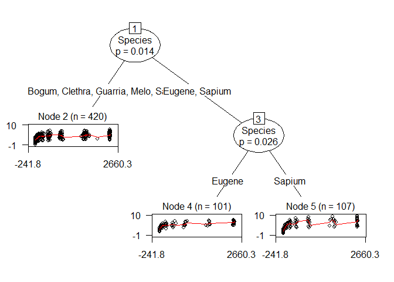
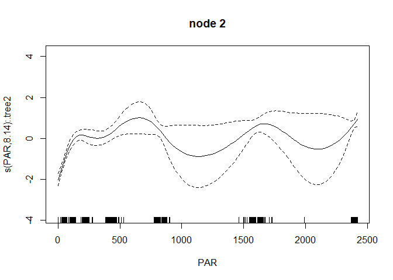
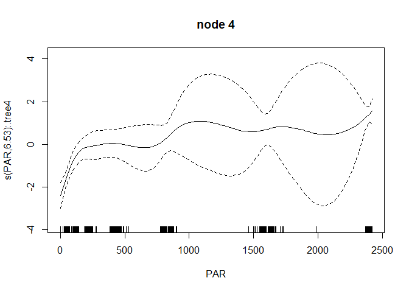
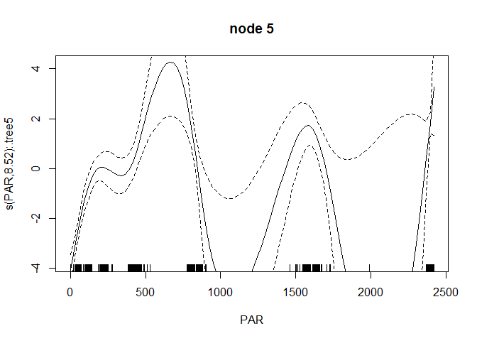
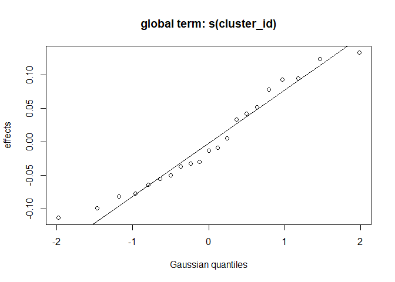
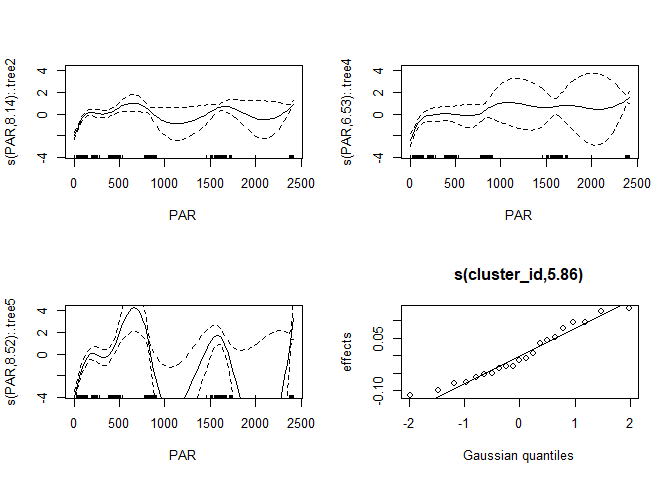

# To-do list

-   Add support for fitting GAMs using `bam()` instead of `gam()` (e.g.,
    create `bam_fit` function, or include additional argument
    `type = c("gam", "bam")` in `gam_fit()` function). Using `bam()`
    also allows for specifying the `coef` argument (initial values for
    model coefficients), which could be passed from the model in the
    current node.

-   Issue: The estimated smooths from the tree and the full GAM have
    similar, but not the same coefficients. Is that problematic? See
    section below.

-   Testing: Evaluate performance using real and simulated data.

-   Allow for having an intercept-only model in the terminal nodes

-   Develop nicer summary and print methods

# Issue: Different coefficient estimates

``` r
library("gamtree")
gt1 <- gamtree(Pn ~ s(PAR) | Species, data = eco, verbose = FALSE, 
               cluster = eco$specimen)
gt2 <- gamtree(Pn ~ s(PAR) | noise + s(cluster_id, bs="re") | Species,
               data = eco, verbose = FALSE, cluster = eco$specimen)
```

The estimated coefficients from the final tree use the predictions based
on global effects from the full GAM from the second-to-last iteration:

``` r
coef(gt1)
```

    ##   (Intercept)   s(PAR).1  s(PAR).2  s(PAR).3  s(PAR).4  s(PAR).5   s(PAR).6
    ## 2    3.700746  -4.229937 -8.925765 -6.419708 -3.123013  4.133930 9.13784734
    ## 4    4.710368  -3.992768 -9.397897 -7.868900 -3.059983 -1.058191 5.48472474
    ## 5    5.285132 -10.109006 23.118991 14.836167 41.452806 55.693627 0.02877788
    ##     s(PAR).7   s(PAR).8 s(PAR).9
    ## 2   1.107162   6.000138 12.78004
    ## 4   2.962870   7.508345 11.30423
    ## 5 -11.010620 -49.776075 44.36823

``` r
coef(gt1$tree)
```

    ##   (Intercept)   s(PAR).1   s(PAR).2   s(PAR).3   s(PAR).4  s(PAR).5  s(PAR).6
    ## 2    3.680405  -4.450707  -9.273774  -6.890283 -2.9187555 -3.301982  9.802856
    ## 4    4.875050   3.700263 -12.796646 -11.071199 -0.6819658 -2.496246  7.689810
    ## 5    5.196168 -10.773631  18.830462  10.236554 21.7896631  5.485991 29.524685
    ##       s(PAR).7   s(PAR).8 s(PAR).9
    ## 2 -0.007723617   6.302115 12.59880
    ## 4 -7.066515961  12.101445 15.78517
    ## 5 51.559591044 -44.310344 41.96981

The ‘severity’ of the differences between the estimated coefficients is
difficult to judge. If we look at the plotted partial effects of the
smooth terms, we see very similar, but not identical effects.

The partial effects as estimated in the tree nodes:

``` r
plot(gt2, which = "nodes", gamplot_ctrl = list(residuals = TRUE, ylim = c(-3.8, 4.2)))
```

    ## Warning in plot.gamtree(gt2, which = "nodes", gamplot_ctrl = list(residuals =
    ## TRUE, : Argument which should specify one of 'tree', 'terms' or 'both'



The partial effects as estimated in the full model:

``` r
par(mfrow = c(2, 2))
plot(gt2$gamm, residuals = TRUE, ylim = c(-3.8, 4.2))
```



We can also compare the predicted values:

``` r
newdat <- eco
newdat$x <- newdat$PAR
preds <- data.frame(gam = predict(gt2$gamm),
                    tree = predict(gt2$tree, newdata = newdat, 
                                   type = "response"))
cor(preds)
```

    ##            gam      tree
    ## gam  1.0000000 0.9981619
    ## tree 0.9981619 1.0000000

``` r
colMeans(preds)
```

    ##      gam     tree 
    ## 4.130796 4.134305

``` r
sapply(preds, var)
```

    ##      gam     tree 
    ## 1.748725 1.747762

``` r
sapply(preds, max)
```

    ##      gam     tree 
    ## 7.501499 7.274412

``` r
sapply(preds, min)
```

    ##      gam     tree 
    ## 1.135808 1.255259

``` r
cols <- c(rep("white", times = 2), "yellow", "orange", "white", 
          "purple", "blue") 
```

The predicted values are very similar, but not identical.

The differences are likely due to the different ways of estimating a
smooth with the `by` argument specified (which is used for estimating
the full GAM), and estimating separate smooths in each subgroup (which
is done in estimating the partition with local GAMs). The scale and
smoothing parameters differ between these two approaches:

Smoothing and scale parameters for the full GAM:

``` r
gt2$gamm$sp
```

    ## s(PAR):.tree2 s(PAR):.tree4 s(PAR):.tree5 s(cluster_id) 
    ##  2.772777e-03  3.548033e-03  1.357165e-04  6.748856e+01

``` r
gt2$gamm$scale
```

    ## [1] TRUE

For the GAMs in the terminal nodes, we obtain different values for the
smoothing parameters:

``` r
gt2$tree[[2]]$node$info$object$sp
```

    ##      s(PAR) 
    ## 0.003401764

``` r
gt2$tree[[4]]$node$info$object$sp
```

    ##      s(PAR) 
    ## 0.001136981

``` r
gt2$tree[[5]]$node$info$object$sp
```

    ##       s(PAR) 
    ## 0.0001236358

This is probably due to a separate scale parameter being estimated in
each node, instead of a single global one in the full GAM:

``` r
gt2$tree[[2]]$node$info$object$scale
```

    ## [1] TRUE

``` r
gt2$tree[[4]]$node$info$object$scale
```

    ## [1] TRUE

``` r
gt2$tree[[5]]$node$info$object$scale
```

    ## [1] TRUE
