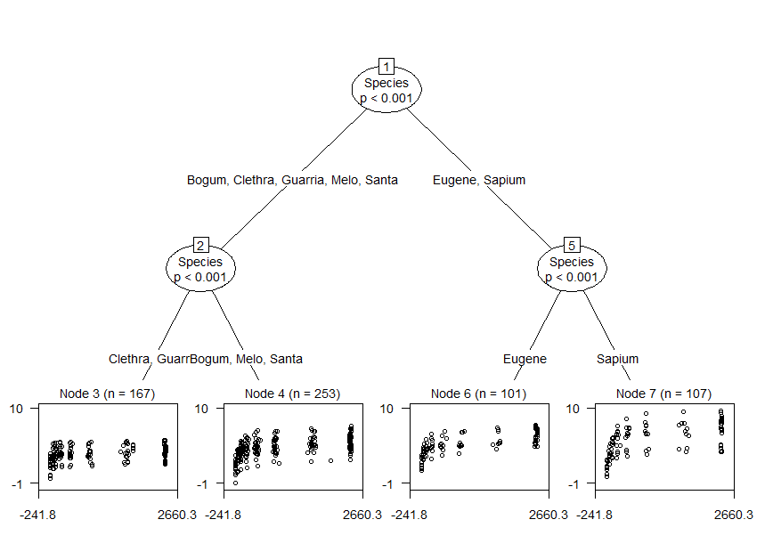
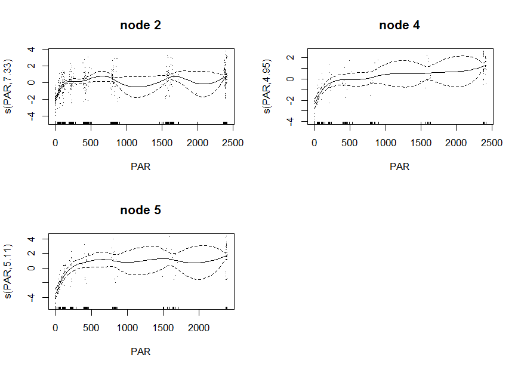
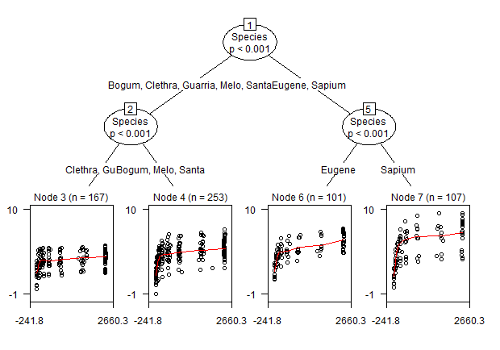
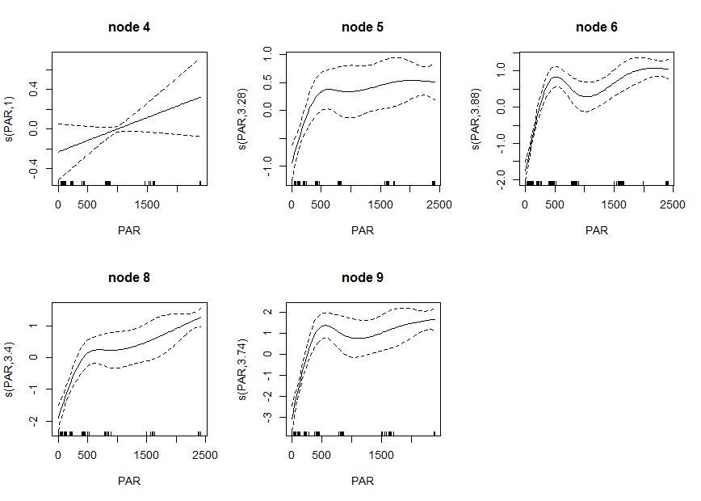
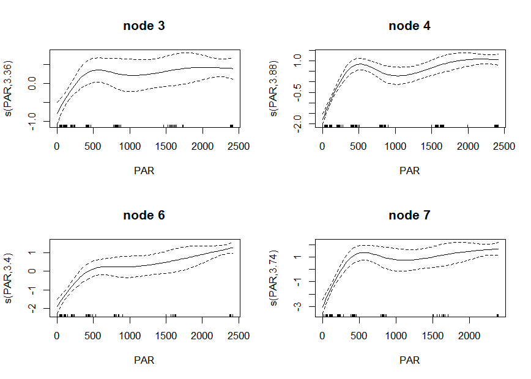
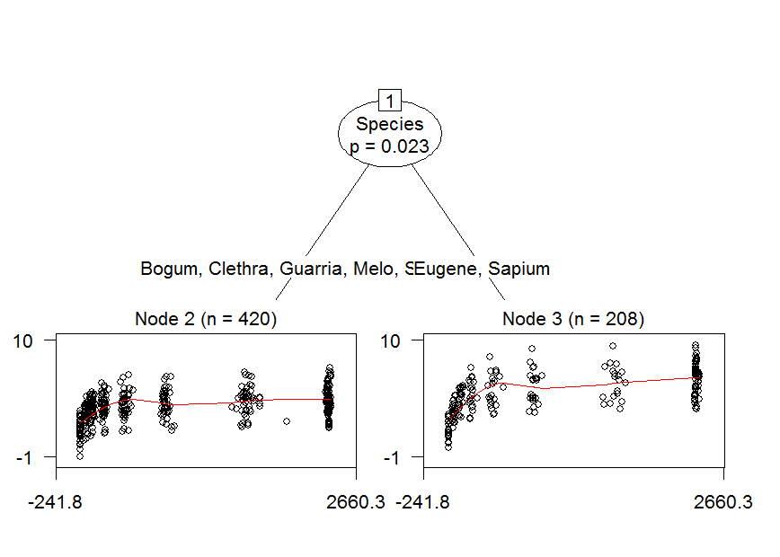
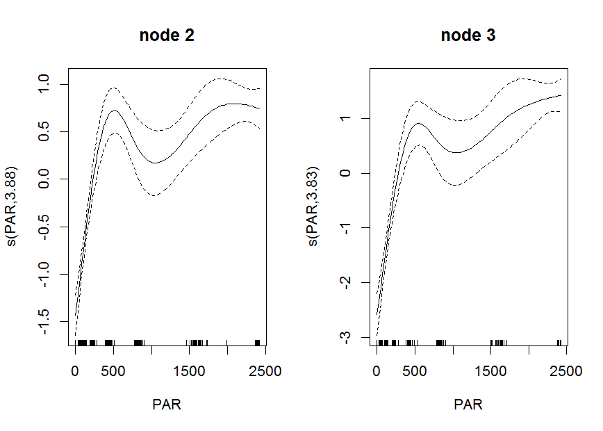
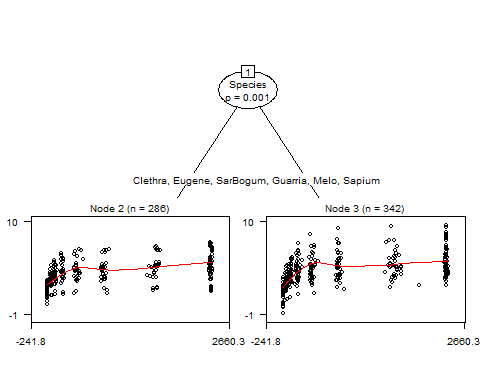
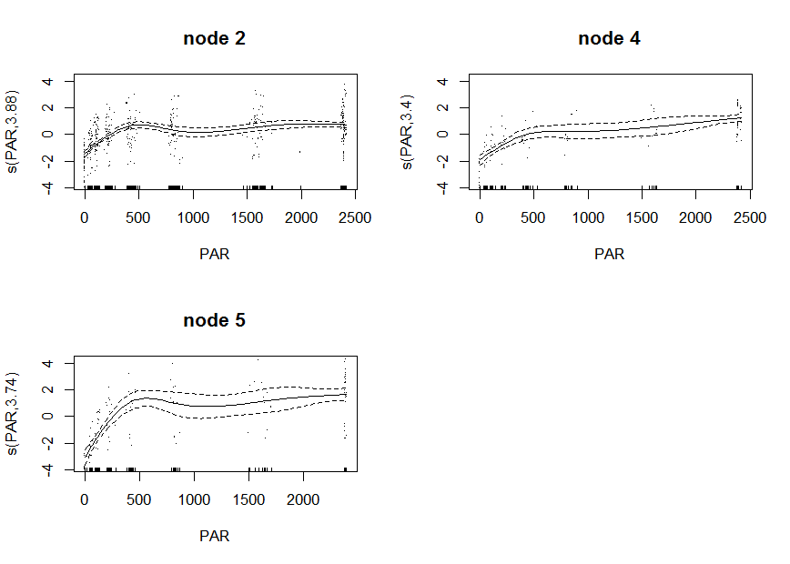

gamtree: Generalized additive model trees
=========================================

Experimental functions for fitting partially additive GAMs: GAMs comprising both global and local model components. The local components are fitted on subgroups of the training dataset, which are detected using model-based recursive partitioning. The global components are fitted on all observations of the training dataset. Specification of local components is required, specification of global components is optional. Some examples are provided below.

For fitting the smooth and parametric terms, package **mgcv** is employed. For recursive partitioning, package **partykit** is employed.

The package is experimental and much work needs to be done still.

To-do list
----------

-   Add support for fitting GAMs using `bam()` instead of `gam()` (e.g., create `bam_fit` function, or include additional argument `type = c("gam", "bam")` in `gam_fit()` function.)

-   The estimated smooths from the tree and the full GAM have similar, but not the same coefficients. Is that problematic? See section `Different coefficient estimates` below.

-   Perform a simulation study to evaluate accuracy. Generate data where there is a local smooth term, with varying coefficients, as well as a global model with random effects and an additional global smooth or global parametric term. Compare accuracy of a full partially additive GAM (i.e., function `gamtree()` with `gam_form` specified), a partitioned GAM (i.e., local GAMs only; function `gamtree()` with `gam_form = NULL`), and a globally fitted GAM (i.e., no partitioning, function `gam()`).

-   Compare performance of function `gamtree()` (with and without `gam_form` specified) and `gam()` as in simulation study, but use existing data.

Example
=======

First, we load the package:

``` r
library("gamtree")
```

Next, we load an example dataset to illustrate the functionality of package **gamtree**:

``` r
data(eco)
```

GAM-based recursive partition without global effects
----------------------------------------------------

We first fit a GAM-based recursive partition without global effects. In that case, we only have to specify the first formula argument (`tree_form`). Only the predictor and response variables need to be specified. By default, a smooth function of the predictor will be fitted, using function `s()` from package **mgcv**. The default arguments of function `s()` will be employed, later examples will show how the arguments of function `s()` can be specified:

``` r
gt1 <- gamtree(Pn ~ PAR | Species, data = eco, verbose = FALSE)
```

By default, `gamtree()` plots progress information to the command line, which was suppressed here by specifying `verbose = FALSE`.

We can inspect the partition by plotting it as follows:

``` r
plot(gt1, which = "tree", gp = gpar(cex = .7))
```



By specifying the `gp` argument, the font size for the node and path labels were reduced in size.

Using the `plot` method, we can also inspect the fitted GAMs in the terminal nodes:

``` r
plot(gt1, which = "nodes")
```



Or, using the `coef` method we can plot the coefficients from the terminal nodes:

``` r
coef(gt1)
#>   (Intercept)  s(PAR).1  s(PAR).2  s(PAR).3   s(PAR).4  s(PAR).5  s(PAR).6
#> 3    3.230242 -1.191546 -4.964831 -2.569836 -2.4617695 -1.749058  2.153920
#> 4    4.032519 -4.612813 -6.982478 -5.859755  0.9888985  5.272665  5.282995
#> 6    4.710382 -2.382514 -6.350333 -3.929474 -1.9832401 -1.788678  2.580555
#> 7    5.239394 -7.958924 -5.666380 -4.360085 10.6489252 14.644888 11.428629
#>     s(PAR).7  s(PAR).8  s(PAR).9
#> 3  0.5780423  4.785539  1.992868
#> 4  1.3128324  2.297865 14.543930
#> 6  0.9023321  5.456551  5.171878
#> 7 -2.9895820 -4.103480 25.734833
```

The plots in the terminal nodes indicate somewhat wiggly lines. Inspecting the distribution of the observations in the terminal nodes, these wiggly lines may overfit the data somewhat. We may thus want to specify a lower value for argument `k` of function `s()` (i.e., number of estimated coefficients for the thin-plate regression spline). We can pass a list of addtional arguments to function `s()` through the `s_ctrl` argument of function `gamtree()`:

``` r
gt2 <- gamtree(Pn ~ PAR | Species, data = eco, verbose = FALSE, 
               s_ctrl = list(k = 5L))
plot(gt2, which = "tree", gp = gpar(cex = .7))
```



``` r
plot(gt2, which = "nodes")
```



The lines are less wiggly, which seems more appropriate (at least, to the eye). However, terminal node 4 and 5 has a model which is almost linear. Perhaps this is due to the small node size. Also, the *p* value for the split separating nodes 4 and 5 is somewhat higher than the other *p* values, again indicating that this split may be less reliable.

We can do an additional check on the observation-level contributions to the gradient. These should sum to (a value close to) zero. We can do this using the `check_grad()` function. It computes the sum of the observation-wise contributions to the gradient. These sums should be reasonably close to zero:

``` r
check_grad(gt2)
#>     (Intercept)   s(PAR).1   s(PAR).2     s(PAR).3      s(PAR).4
#> 1 -1.328514e-12 -0.2229052 -0.3263868 -0.062062577  2.233179e-13
#> 2  5.329686e-13 -0.2310867 -0.3937828 -0.073902025  5.143761e-13
#> 3  4.073512e-13  0.5160471  0.6743395 -0.094638244 -1.343778e-13
#> 4  2.882070e-14 -1.6493277  0.8670495  1.610205726 -5.049780e-15
#> 5  1.381373e-13  0.5839106 -0.6469227 -0.051403316 -1.142792e-14
#> 6  6.471646e-14 -0.2233013  0.3374876 -0.059188737 -8.044177e-13
#> 7  1.378203e-13  0.2108973  0.2446822 -0.031231124  3.154733e-13
#> 8 -2.010545e-13  0.5391678 -0.3921504 -0.001776875 -1.833637e-13
#> 9  1.756460e-13 -0.1995831 -0.1948963 -0.025229130  5.905346e-14
```

We see the largest non-zero values for (terminal) node 4. All in all, the results indicate that it may be better to collapse nodes 4 and 5. We can do that through specifying the `maxdepth` argument, which should be passed to the `mob_ctrl`, which controls the recursive partitioning:

``` r
gt3 <- gamtree(Pn ~ PAR | Species, data = eco, verbose = FALSE,
               s_ctrl = list(k = 5L), mob_ctrl = mob_control(maxdepth = 3L))
plot(gt3, which = "tree", gp = gpar(cex = .7))
```


``` r
plot(gt3, which = "nodes")
```



By collapsing nodes 4 and 5, we get a more non-linear curve, which seems to provide a somewhat better representation of the datapoints.

GAM-based recursive partition with global effects
-------------------------------------------------

We use function `gamertree()` to fit the same tree as above (specified through the `tree_form` argument), as well as a global model. The global model is specified through the second `gam_form` argument, which is `NULL` by default, indicating that there are only local parameters to be estimated.

Again, we have to use the `s_ctrl` argument to pass the `k` argument to function `s()` used in the partitioning. Note also that the arguments for the global model are specified in the formula directly, as is customary for the `gam()` function:

``` r
gt4 <- gamtree(tree_form = Pn ~ PAR | Species, 
               gam_form = Pn ~ noise + s(cluster_id, bs = "re"),
               data = eco, verbose = FALSE, s_ctrl = list(k = 5L),  
               mob_ctrl = mob_control(maxdepth = 3L))
gt4$iterations
#> [1] 2
```

Estimation converged in two iterations. Probably because accounting for the global effects has little effect for these data, as specified predictors for the global model are in fact noise variables. We can obtain test statistics for the significance of the global and local effects in the full GAMM as follows:

``` r
summary(gt4$gamm) 
#> 
#> Family: gaussian 
#> Link function: identity 
#> 
#> Formula:
#> Pn ~ .tree + s(PAR, k = 5, by = .tree) + noise + s(cluster_id, 
#>     bs = "re") - 1
#> 
#> Parametric coefficients:
#>        Estimate Std. Error t value Pr(>|t|)    
#> .tree3  3.22539    0.09431  34.200   <2e-16 ***
#> .tree4  4.03340    0.07830  51.510   <2e-16 ***
#> .tree6  4.70468    0.12040  39.075   <2e-16 ***
#> .tree7  5.20582    0.11584  44.940   <2e-16 ***
#> noise  -0.02879    0.04409  -0.653    0.514    
#> ---
#> Signif. codes:  0 '***' 0.001 '**' 0.01 '*' 0.05 '.' 0.1 ' ' 1
#> 
#> Approximate significance of smooth terms:
#>                 edf Ref.df      F p-value    
#> s(PAR):.tree3 3.074  3.502  6.150 0.00013 ***
#> s(PAR):.tree4 3.854  3.984 50.816 < 2e-16 ***
#> s(PAR):.tree6 3.200  3.616 27.842 < 2e-16 ***
#> s(PAR):.tree7 3.862  3.986 58.480 < 2e-16 ***
#> s(cluster_id) 5.290 20.000  0.366 0.12451    
#> ---
#> Signif. codes:  0 '***' 0.001 '**' 0.01 '*' 0.05 '.' 0.1 ' ' 1
#> 
#> R-sq.(adj) =  0.563   Deviance explained =   58%
#> -REML = 1010.4  Scale est. = 1.3293    n = 628
```

Note that the standard errors and degrees of freedom do not account for the searching of the tree structure and are therefore likely too low, yielding overly optimistic (i.e., too low) *p* values.

The effect of the smooths is significant in every terminal tree node. As expected, the global fixed and random effects are not significant. We will probably also see this in ther estimated random-effects coefficients being close to zero:

``` r
coef(gt4, which = 'global')
#>            noise  s(cluster_id).1  s(cluster_id).2  s(cluster_id).3 
#>     -0.028787865     -0.029592481      0.038006263      0.012631700 
#>  s(cluster_id).4  s(cluster_id).5  s(cluster_id).6  s(cluster_id).7 
#>     -0.043576839     -0.059470008      0.059928989      0.044146051 
#>  s(cluster_id).8  s(cluster_id).9 s(cluster_id).10 s(cluster_id).11 
#>     -0.100777772      0.068139221     -0.060524827      0.048664389 
#> s(cluster_id).12 s(cluster_id).13 s(cluster_id).14 s(cluster_id).15 
#>      0.039413729      0.047009803     -0.126147204      0.078816613 
#> s(cluster_id).16 s(cluster_id).17 s(cluster_id).18 s(cluster_id).19 
#>     -0.035065788      0.102517787      0.070602669     -0.096852950 
#> s(cluster_id).20 s(cluster_id).21 
#>     -0.048195629     -0.009673717
```

By default, the `coef` method returns the local estimates:

``` r
coef(gt4)
#>   (Intercept)   s(PAR).1   s(PAR).2  s(PAR).3 s(PAR).4
#> 3    3.225386 -0.8060172  -2.264942  2.195641 1.280674
#> 4    4.033400 -2.3006331  -8.361299  6.770634 3.699212
#> 6    4.704682 -1.5716238  -3.329140  3.068002 2.831568
#> 7    5.205817 -4.1620025 -12.986797 10.713682 6.406701
```

We can plot the tree and the models fitted in each of the terminal nodes:

``` r
plot(gt4, which = "tree", gp = gpar(cex = .7))
```



``` r
plot(gt4, which = "nodes")
```



Again, we check whether the sums of the observation-wise gradient contributions are reasonably close to zero:

``` r
check_grad(gt4)
#>     (Intercept)   s(PAR).1   s(PAR).2     s(PAR).3      s(PAR).4
#> 1 -3.293126e-12 -0.2228215 -0.3250462 -0.061866417  3.435620e-14
#> 2  1.553684e-12 -0.2328691 -0.3914508 -0.073040482 -1.851280e-13
#> 3  5.272657e-13  0.4648579  0.6583370 -0.096147638 -1.450636e-13
#> 4  8.915646e-13 -0.2285045  0.3363891 -0.058578422 -7.814478e-13
#> 5 -1.229711e-13  0.2081474  0.2444110 -0.032048797  6.687186e-14
#> 6  2.990923e-13  0.5075382 -0.3905972 -0.009973962 -1.654232e-13
#> 7  1.887041e-13 -0.1983986 -0.1957637 -0.025919877 -3.177797e-14
```

All observation-wise gradient contributions sum to values reasonably close to 0.

Specifying multiple predictor variables for the node-specific GAMs
------------------------------------------------------------------

If multiple predictors are specified in the node-specific model, they will both be passed into the same `s()` call, by default:

``` r
gt5 <- gamtree(tree_form = Pn ~ PAR + noise | Species, 
               gam_form = Pn ~ s(cluster_id, bs = "re"),
               data = eco, verbose = FALSE, s_ctrl = list(k = 5L),  
               mob_ctrl = mob_control(maxdepth = 3L))
summary(gt5$gamm)
#> 
#> Family: gaussian 
#> Link function: identity 
#> 
#> Formula:
#> Pn ~ .tree + s(PAR, noise, k = 5, by = .tree) + s(cluster_id, 
#>     bs = "re") - 1
#> 
#> Parametric coefficients:
#>        Estimate Std. Error t value Pr(>|t|)    
#> .tree3  3.21968    0.09945   32.37   <2e-16 ***
#> .tree4  3.93384    0.10681   36.83   <2e-16 ***
#> .tree6  4.16029    0.11950   34.81   <2e-16 ***
#> .tree7  4.95300    0.09044   54.77   <2e-16 ***
#> ---
#> Signif. codes:  0 '***' 0.001 '**' 0.01 '*' 0.05 '.' 0.1 ' ' 1
#> 
#> Approximate significance of smooth terms:
#>                       edf Ref.df      F  p-value    
#> s(PAR,noise):.tree3 3.561  3.870  5.348 0.000241 ***
#> s(PAR,noise):.tree4 3.891  3.991 22.862  < 2e-16 ***
#> s(PAR,noise):.tree6 3.819  3.977 19.110 4.93e-15 ***
#> s(PAR,noise):.tree7 3.952  3.998 71.810  < 2e-16 ***
#> s(cluster_id)       6.424 20.000  0.478 0.079841 .  
#> ---
#> Signif. codes:  0 '***' 0.001 '**' 0.01 '*' 0.05 '.' 0.1 ' ' 1
#> 
#> R-sq.(adj) =  0.531   Deviance explained =   55%
#> -REML = 1029.3  Scale est. = 1.4277    n = 628
coef(gt5$tree)
#>   (Intercept) s(PAR,noise).1 s(PAR,noise).2 s(PAR,noise).3 s(PAR,noise).4
#> 3    3.234613      -1.912710       5.808017      0.5976989    -0.09902575
#> 4    3.841010       1.710974       8.797858      1.4180591     0.05382627
#> 6    4.165665      10.058699       8.538073      0.8893021     0.01125373
#> 7    5.041897      48.885719      35.938586      2.5567082    -0.01713797
```

Alternatively, multiple local smooth terms will be estimated by specifying the `n_FUN` argument (which equals `1L`, by default):

``` r
gt6 <- gamtree(tree_form = Pn ~ PAR + noise | Species, 
               gam_form = Pn ~ s(cluster_id, bs = "re"),
               data = eco, verbose = FALSE, s_ctrl = list(k = 5L),  
               mob_ctrl = mob_control(maxdepth = 3L),
               n_FUN = 2L)
summary(gt6$gamm)
#> 
#> Family: gaussian 
#> Link function: identity 
#> 
#> Formula:
#> Pn ~ .tree + s(PAR, k = 5, by = .tree) + s(noise, k = 5, by = .tree) + 
#>     s(cluster_id, bs = "re") - 1
#> 
#> Parametric coefficients:
#>        Estimate Std. Error t value Pr(>|t|)    
#> .tree3  3.21838    0.09470   33.99   <2e-16 ***
#> .tree4  4.03440    0.07852   51.38   <2e-16 ***
#> .tree6  4.70396    0.12056   39.02   <2e-16 ***
#> .tree7  5.20909    0.11621   44.82   <2e-16 ***
#> ---
#> Signif. codes:  0 '***' 0.001 '**' 0.01 '*' 0.05 '.' 0.1 ' ' 1
#> 
#> Approximate significance of smooth terms:
#>                   edf Ref.df      F  p-value    
#> s(PAR):.tree3   3.124  3.546  5.734 0.000232 ***
#> s(PAR):.tree4   3.851  3.983 50.362  < 2e-16 ***
#> s(PAR):.tree6   3.246  3.656 27.214  < 2e-16 ***
#> s(PAR):.tree7   3.862  3.986 58.490  < 2e-16 ***
#> s(noise):.tree3 1.001  1.001  1.396 0.237981    
#> s(noise):.tree4 1.632  2.015  0.418 0.686390    
#> s(noise):.tree6 1.000  1.001  0.074 0.786475    
#> s(noise):.tree7 1.001  1.001  0.265 0.606752    
#> s(cluster_id)   5.374 20.000  0.375 0.118184    
#> ---
#> Signif. codes:  0 '***' 0.001 '**' 0.01 '*' 0.05 '.' 0.1 ' ' 1
#> 
#> R-sq.(adj) =  0.564   Deviance explained = 58.2%
#> -REML = 1013.1  Scale est. = 1.3293    n = 628
coef(gt6$tree)
#>   (Intercept)  s(PAR).1   s(PAR).2 s(PAR).3 s(PAR).4    s(noise).1
#> 3    3.234900  1.065684   3.683415 3.174986 1.560575  3.566699e-05
#> 4    3.980515 -2.341694   8.187016 6.544066 3.650087  9.304479e-02
#> 6    4.871948  1.470086  -5.119634 4.418296 3.439205  9.393597e-06
#> 7    5.202619 -4.041787 -11.969899 9.970974 6.362578 -7.034408e-06
#>      s(noise).2    s(noise).3  s(noise).4
#> 3  5.853175e-05  4.120733e-04 -0.11055632
#> 4 -6.620321e-02  2.809929e-01  0.09203265
#> 6 -2.306391e-06 -1.037433e-05  0.03894643
#> 7  1.185359e-05 -7.035602e-05 -0.05489157
```

Alternatively, a different function than `s()` can be employed by specifying the `FUN` argument (which equals `s`, by default). The `k` argument ha a different effect for `te()` than for `()`, so we set it to a lower value here:

``` r
gt7 <- gamtree(tree_form = Pn ~ PAR + noise | Species, 
               gam_form = Pn ~ s(cluster_id, bs = "re"),
               data = eco, verbose = FALSE, s_ctrl = list(k = 3L),  
               mob_ctrl = mob_control(maxdepth = 3L),
               FUN = "te")
summary(gt7$gamm)
#> 
#> Family: gaussian 
#> Link function: identity 
#> 
#> Formula:
#> Pn ~ .tree + te(PAR, noise, k = 3, by = .tree) + s(cluster_id, 
#>     bs = "re") - 1
#> 
#> Parametric coefficients:
#>        Estimate Std. Error t value Pr(>|t|)    
#> .tree3  3.22699    0.10039   32.15   <2e-16 ***
#> .tree4  4.03382    0.08266   48.80   <2e-16 ***
#> .tree6  4.71681    0.12807   36.83   <2e-16 ***
#> .tree7  5.25377    0.12631   41.59   <2e-16 ***
#> ---
#> Signif. codes:  0 '***' 0.001 '**' 0.01 '*' 0.05 '.' 0.1 ' ' 1
#> 
#> Approximate significance of smooth terms:
#>                        edf Ref.df      F  p-value    
#> te(PAR,noise):.tree3 3.975  4.364  4.461  0.00115 ** 
#> te(PAR,noise):.tree4 4.687  4.925 29.703  < 2e-16 ***
#> te(PAR,noise):.tree6 4.345  4.872 17.256 1.15e-15 ***
#> te(PAR,noise):.tree7 6.337  7.093 25.371  < 2e-16 ***
#> s(cluster_id)        4.707 20.000  0.311  0.15707    
#> ---
#> Signif. codes:  0 '***' 0.001 '**' 0.01 '*' 0.05 '.' 0.1 ' ' 1
#> 
#> R-sq.(adj) =  0.506   Deviance explained = 52.7%
#> -REML = 1023.4  Scale est. = 1.5059    n = 628
coef(gt7$tree)
#>   (Intercept) te(PAR,noise).1 te(PAR,noise).2 te(PAR,noise).3
#> 3    3.236996      -0.5061737      -1.0361279       0.5822966
#> 4    3.978833      -0.6561934      -0.6385351       0.2817264
#> 6    4.873337      -0.6330718      -1.2422168       0.6965196
#> 7    5.200054      -0.7250602      -1.6299230       1.0690797
#>   te(PAR,noise).4 te(PAR,noise).5 te(PAR,noise).6 te(PAR,noise).7
#> 3       0.2082286      -0.1316632       0.3586793       0.3537505
#> 4       1.4394798       0.1922294       1.3481133       1.7226577
#> 6       1.0157525      -0.4229346       1.2664058       2.2286502
#> 7       2.1109914       1.0724397       3.2269832       2.9825189
#>   te(PAR,noise).8
#> 3       0.3917477
#> 4       0.7414001
#> 6       1.3803256
#> 7      -0.2205939
```

Issue: Different coefficient estimates
======================================

The estimated coefficients from the final tree use the predictions based on global effects from the full GAM from the second-to-last iteration. As far as I know, this should yield the exact same coefficient estimates between the tree and the full GAM. But they are not (though similar) and I am not sure if this is something to be worried about:

``` r
coef(gt4)
#>   (Intercept)   s(PAR).1   s(PAR).2  s(PAR).3 s(PAR).4
#> 3    3.225386 -0.8060172  -2.264942  2.195641 1.280674
#> 4    4.033400 -2.3006331  -8.361299  6.770634 3.699212
#> 6    4.704682 -1.5716238  -3.329140  3.068002 2.831568
#> 7    5.205817 -4.1620025 -12.986797 10.713682 6.406701
coef(gt4$tree)
#>   (Intercept)  s(PAR).1   s(PAR).2 s(PAR).3 s(PAR).4
#> 3    3.230887  1.061583   3.442826 3.012195 1.553726
#> 4    3.979951 -2.349509   8.283117 6.626512 3.666240
#> 6    4.871748  1.373794  -4.872928 4.263550 3.310980
#> 7    5.203570 -4.052907 -11.907712 9.936958 6.367029
```

``` r
plot(gt4, which = "nodes")
```


``` r
par(mfrow = c(2, 3))
plot(gt4$gamm)
```



The plots also indicate very similar, but not identical effects.

We can also compare the predicted values:

``` r
newdat <- eco
newdat$x <- newdat$PAR
preds <- data.frame(gamtree = predict(gt4),
                    gam = predict(gt4$gamm),
                    tree = predict(gt4$tree, newdata = newdat, 
                                   type = "response"))
cor(preds)
#>           gamtree       gam      tree
#> gamtree 1.0000000 1.0000000 0.9980367
#> gam     1.0000000 1.0000000 0.9980367
#> tree    0.9980367 0.9980367 1.0000000
colMeans(preds)
#>  gamtree      gam     tree 
#> 4.130796 4.130796 4.132666
sapply(preds, var)
#>  gamtree      gam     tree 
#> 1.700635 1.700635 1.701535
sapply(preds, max)
#>  gamtree      gam     tree 
#> 6.950960 6.950960 6.873325
sapply(preds, min)
#>  gamtree      gam     tree 
#> 2.001505 2.001505 2.166788
```

The predicted values seem very similar, but not the same.

The same happens when we have no global parameters, but re-estimate the smooth parameters, given the subgroups from the tree:

``` r
coef(gt1)
#>   (Intercept)  s(PAR).1  s(PAR).2  s(PAR).3   s(PAR).4  s(PAR).5  s(PAR).6
#> 3    3.230242 -1.191546 -4.964831 -2.569836 -2.4617695 -1.749058  2.153920
#> 4    4.032519 -4.612813 -6.982478 -5.859755  0.9888985  5.272665  5.282995
#> 6    4.710382 -2.382514 -6.350333 -3.929474 -1.9832401 -1.788678  2.580555
#> 7    5.239394 -7.958924 -5.666380 -4.360085 10.6489252 14.644888 11.428629
#>     s(PAR).7  s(PAR).8  s(PAR).9
#> 3  0.5780423  4.785539  1.992868
#> 4  1.3128324  2.297865 14.543930
#> 6  0.9023321  5.456551  5.171878
#> 7 -2.9895820 -4.103480 25.734833
coef(gt1$tree)
#>   (Intercept)  s(PAR).1   s(PAR).2  s(PAR).3  s(PAR).4  s(PAR).5  s(PAR).6
#> 3    3.235629  1.562813   6.561351  1.509856 -4.468660 -3.207706 -2.624763
#> 4    3.973992 -4.864035   7.677295  6.716258  3.197410 -2.745029 -6.874911
#> 6    4.875050  2.118485  -9.365924 -7.057664 -1.791072 -2.357813  4.049454
#> 7    5.196168 -5.583318 -14.790424 -9.290344 -3.934561 -7.341857 -4.233135
#>     s(PAR).7  s(PAR).8  s(PAR).9
#> 3 -2.2612071  6.578482  2.257255
#> 4 -0.3944037  2.401305 14.931456
#> 6 -2.9141972  8.524812  7.734190
#> 7 -3.0578102 12.046898 12.241839
```

``` r
plot(gt1, which = "nodes")
```


``` r
par(mfrow = c(2, 2))
plot(gt1$gamm)
```



``` r
preds <- data.frame(gamtree = predict(gt1),
                    gam = predict(gt1$gamm),
                    tree = predict(gt1$tree, newdata = newdat, 
                                   type = "response"))
cor(preds)
#>           gamtree       gam      tree
#> gamtree 1.0000000 1.0000000 0.9958099
#> gam     1.0000000 1.0000000 0.9958099
#> tree    0.9958099 0.9958099 1.0000000
colMeans(preds)
#>  gamtree      gam     tree 
#> 4.130796 4.130796 4.130796
sapply(preds, var)
#>  gamtree      gam     tree 
#> 1.818162 1.818162 1.795889
sapply(preds, max)
#>  gamtree      gam     tree 
#> 7.027005 7.027005 6.888124
sapply(preds, min)
#>  gamtree      gam     tree 
#> 1.288532 1.288532 1.614462
```
