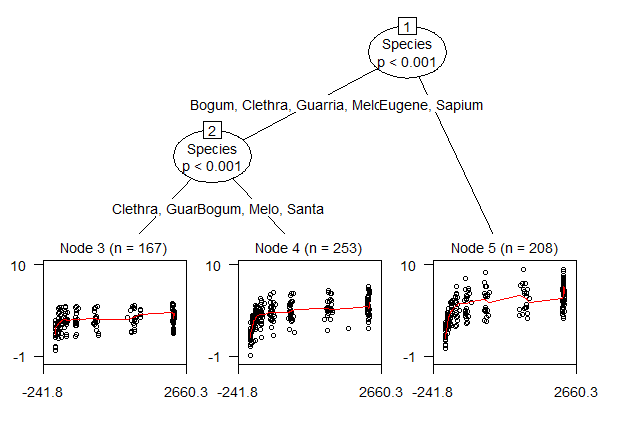
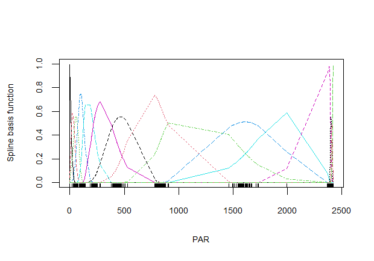
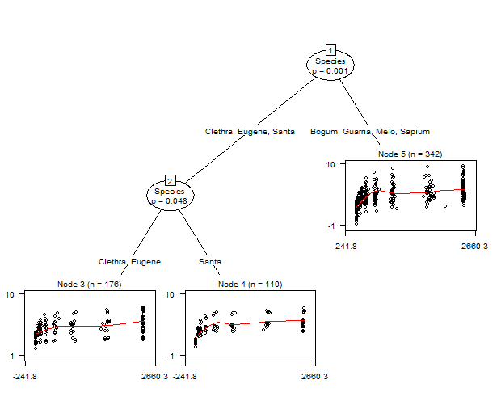
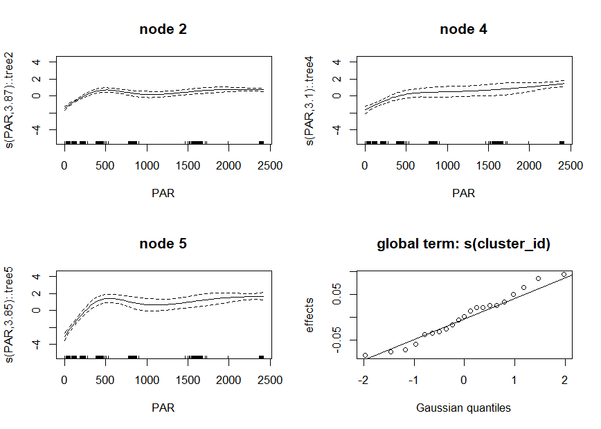
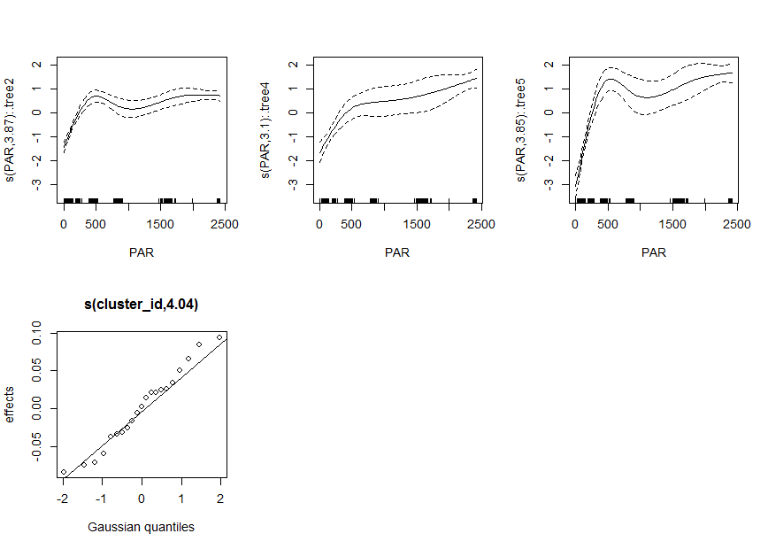

gamtree: Generalized additive model trees
=========================================

Experimental functions for fitting partially additive GAMs: GAMs
comprising both global and local model components. The local components
are fitted on subgroups of the training dataset, which are detected
using model-based recursive partitioning. The global components are
fitted on all observations of the training dataset. Specification of
local components is required, specification of global components is
optional. Some examples are provided below.

For fitting the smooth and parametric terms, package **mgcv** is
employed. For recursive partitioning, package **partykit** is employed.

The package is under development; much work and testing still needs to be done. The current version of the package can be installed as follows:

```{r}
library(devtools)
install_github("marjoleinF/gamtree")
```

Examples
========

First, we load the package:

``` r
library("gamtree")
```

Next, we load an example dataset to illustrate the functionality of
package **gamtree**:

``` r
data(eco)
summary(eco)
#>     Species         PAR               Pn           cluster_id 
#>  Bogum  : 96   Min.   :   0.0   Min.   :-0.950   8      : 41  
#>  Clethra: 75   1st Qu.: 108.7   1st Qu.: 2.990   4      : 37  
#>  Eugene :101   Median : 458.8   Median : 4.050   11     : 37  
#>  Guarria: 92   Mean   : 975.0   Mean   : 4.131   14     : 37  
#>  Melo   : 47   3rd Qu.:2376.4   3rd Qu.: 5.082   6      : 35  
#>  Santa  :110   Max.   :2418.5   Max.   : 9.500   10     : 35  
#>  Sapium :107                                     (Other):406  
#>      noise             specimen    
#>  Min.   :-3.00805   Min.   : 2.00  
#>  1st Qu.:-0.77022   1st Qu.:14.00  
#>  Median :-0.05190   Median :25.00  
#>  Mean   :-0.03934   Mean   :25.81  
#>  3rd Qu.: 0.68309   3rd Qu.:38.00  
#>  Max.   : 3.81028   Max.   :48.00  
#> 
```

The data contain 628 observations. The `Species` variable is an
indicator for plant species. Variable `PAR` well be used as a predictor
for the node-specific model, variable `Pn` as the response. Variables
`cluster_id` and `noise` are in fact noise variables, which will be used
to specify global model terms. Finally, `specimen` is an indicator for
the individual plants.

Specifying the model formula
----------------------------

The model is specified through a three- or four-part formula, comprising
a response variable, local (subgroup-specific) terms, partitiong
variables and global terms. Informally written, a full four-part GAM
tree formula can be described as:

``` r
response ~ local terms | global terms | partitioning variables
```

The response must be a single continuous variable. The local terms,
separated from the response by a tilde (`~`), can comprise one or more
smooth and/or parametric terms, as they would be specified in a model
fitted with `gam()`. The global terms, separated from the local terms
comprise one or more smooth and/or parametric terms, as they would be
specified in a model fitted with `gam()`. The partitioning variables,
separated from the global terms by a vertical bar(`|`), are specified by
providing their names. One can think of this GAM tree formulation as:
the effects of the local terms are estimated, conditional on the
estimated global terms, conditional on a subgroup structure based on the
partitioning variables.

It is not required to specify the global terms: they can simply be
omitted by specifying only a two-part left-hand side. This yields a
model with an estimated partition (subgroup structure) with
subgroup-specific estimates of the (local) terms, without any global
terms. The formula can then be described as:

``` r
response ~ local terms | partitioning variables
```

GAM-based recursive partition without global effects
----------------------------------------------------

We first fit a GAM-based recursive partition without global effects. We
specify `Pn` as the response, with a smooth term for `PAR`. We specify
`Species` as the only potential partitioning variable. Furthermore, we
specify the `cluster` argument, which will be passed to the recursive
partitioning procedure (function `mob()` from package **partykit**) to
indicate that the individual observations in the dataset are not
independent, but nested within the different specimen.

``` r
gt1 <- gamtree(Pn ~ s(PAR) | Species, data = eco, verbose = FALSE, 
               cluster = eco$specimen)
```

We also specified the `verbose` argument, to suppress the progress
information which is printed to the command line, by default.

We can inspect the partition by plotting the tree:

``` r
plot(gt1, which = "tree", treeplot_ctrl = list(gp = gpar(cex = .7)))
```


Through the `treeplot_ctrl` argument, we can specify additional argument
to be passed to function `plot.party()`. We passed the `gp` argument, to
have a smaller font size for the node and path labels than with the
default `cex = 1`.

The plots indicate similar trajectories in all three terminal nodes,
revealing a sharp increase first, which then levels off. The increase
appears to level off completely in node 2, while the increase in nodes 4
and 5 only slows down towards the right end.

Alternatively, we can also plot the fitted GAMs in each of the terminal
nodes, which reveals a similar pattern:

``` r
plot(gt1, which = "nodes", gamplot_ctrl = list(residuals = TRUE))
```


We used the `gamplot_ctrl` argument to pass additional arguments to
function `plot.gam()`. We specified the `residuals` argument, so that
partial residuals are included as dots in the plotted smooths.

GAM-based recursive partition with global effects
-------------------------------------------------

We now also include a global part in the fitted model. We add global
terms to the earlier `gamtree` model, based on the `noise` and
`cluster_id` variables. Both are in fact noise variables, so these
should not have significant or substantial effects. They merely serve as
an illustration of specifying a global model. We will specify `noise` as
having a parametric (i.e., linear) effect and `cluster_id` as an
indicator for a random intercept term (which can be fitted using
function `s()` and specifying `bs = "re"`).

To estimate both the local and global models, an iterative approach is
taken:

-   Step 0: Initialize by assuming the global effects to be zero.

-   Step 1: Given the current estimate of the global effects, estimate
    the partition (subgroup structure).

-   Step 2: Given the current estimate of the partition (subgroup
    structure), estimate the local and global effects.

-   Step 3: Repeat steps 1 and 2 untill convergence (i.e., change in
    log-likelihood values from one iteration to the next is smaller than
    `abstol`).

``` r
gt2 <- gamtree(Pn ~ s(PAR) | noise + s(cluster_id, bs="re") | Species,
               data = eco, verbose = FALSE, cluster = eco$specimen)
gt2$iterations
#> [1] 2
```

Estimation converged in two iterations. Probably because accounting for
the global effects has little effect for these data, as the predictors
for the global model are in fact noise variables, the global effects are
thus 0 and the initial estimate of the global effects is already
adequate.

We can obtain test statistics for the significance of the global and
local effects in the full GAM using the `summary` method:

``` r
summary(gt2)
#> 
#> Family: gaussian 
#> Link function: identity 
#> 
#> Formula:
#> Pn ~ .tree + s(PAR, by = .tree) + noise + s(cluster_id, bs = "re") - 
#>     1
#> 
#> Parametric coefficients:
#>         Estimate Std. Error t value Pr(>|t|)    
#> .tree2  3.704028   0.063862  58.000   <2e-16 ***
#> .tree4  4.708579   0.121116  38.876   <2e-16 ***
#> .tree5  5.228896   0.117634  44.451   <2e-16 ***
#> noise  -0.009573   0.044443  -0.215     0.83    
#> ---
#> Signif. codes:  0 '***' 0.001 '**' 0.01 '*' 0.05 '.' 0.1 ' ' 1
#> 
#> Approximate significance of smooth terms:
#>                 edf Ref.df      F p-value    
#> s(PAR):.tree2 7.163  8.118 28.383  <2e-16 ***
#> s(PAR):.tree4 3.924  4.542 23.473  <2e-16 ***
#> s(PAR):.tree5 6.682  7.482 34.041  <2e-16 ***
#> s(cluster_id) 5.420 20.000  0.371    0.13    
#> ---
#> Signif. codes:  0 '***' 0.001 '**' 0.01 '*' 0.05 '.' 0.1 ' ' 1
#> 
#> R-sq.(adj) =   0.56   Deviance explained = 57.9%
#> -REML = 1022.5  Scale est. = 1.339     n = 628
```

Note that the standard errors and degrees of freedom for the smooth and
parametric terms in the terminal nodes (i.e., those terms containing
`.tree`) do not account for the searching of the tree structure and are
therefore likely too low (overly optimistic), yielding too low *p*
values.

The effect of the local smooths are significant in every terminal tree
node. As expected, the global fixed and random effects (`noise` and
`s(cluster_id)`) are not significant. We will also see this in their
estimated random-effects coefficients being close to zero:

``` r
coef(gt2, which = 'global')
#>            noise  s(cluster_id).1  s(cluster_id).2  s(cluster_id).3 
#>     -0.009572879     -0.004188756      0.034801336     -0.030516826 
#>  s(cluster_id).4  s(cluster_id).5  s(cluster_id).6  s(cluster_id).7 
#>     -0.055095623     -0.094127284      0.015228154      0.051448897 
#>  s(cluster_id).8  s(cluster_id).9 s(cluster_id).10 s(cluster_id).11 
#>     -0.103460990      0.088769835     -0.030876592      0.034950115 
#> s(cluster_id).12 s(cluster_id).13 s(cluster_id).14 s(cluster_id).15 
#>      0.051790879      0.001446386     -0.075645504      0.118519437 
#> s(cluster_id).16 s(cluster_id).17 s(cluster_id).18 s(cluster_id).19 
#>     -0.053155464      0.128132937      0.079411719     -0.080637216 
#> s(cluster_id).20 s(cluster_id).21 
#>     -0.028356145     -0.048439297
```

Note that by default, the `coef` method returns the local
(node-specific) estimates, but we can obtain the global coefficient
estimates by specifying the `which` argument.

We can plot the tree and the models fitted in each of the terminal
nodes:

``` r
plot(gt2, which = "tree", treeplot_ctrl = list(gp = gpar(cex = .7)))
```



``` r
plot(gt2, which = "nodes", gamplot_ctrl = list(residuals = TRUE))
```



The local models are very similar to those in the earlier tree, as the
global terms have minor/zero effects.

Evaluating the adequacy of the basis used to represent the smooth terms
-----------------------------------------------------------------------

The plots indicate that the lines of the fitted smooths are somewhat
wiggly, especially in node 2. Perhaps the default dimension for the
basis used to represent the smooth term, `k = 9`, may not be adequate
for these data. In addition to the above visual inspection of how well
the smooths appear to approximate the datapoints, we can use the
`gam.check()` function from package **mgcv** to check the adequacy of
the dimension of the basis used to represent the smooth term:

``` r
gam.check(gt2$gamm)
#> 
#> Method: REML   Optimizer: outer newton
#> full convergence after 7 iterations.
#> Gradient range [-0.0003974739,0.0005464636]
#> (score 1022.483 & scale 1.338975).
#> Hessian positive definite, eigenvalue range [0.3087284,310.5868].
#> Model rank =  52 / 52 
#> 
#> Basis dimension (k) checking results. Low p-value (k-index<1) may
#> indicate that k is too low, especially if edf is close to k'.
#> 
#>                  k'   edf k-index p-value  
#> s(PAR):.tree2  9.00  7.16    0.92   0.025 *
#> s(PAR):.tree4  9.00  3.92    0.92   0.020 *
#> s(PAR):.tree5  9.00  6.68    0.92   0.030 *
#> s(cluster_id) 21.00  5.42      NA      NA  
#> ---
#> Signif. codes:  0 '***' 0.001 '**' 0.01 '*' 0.05 '.' 0.1 ' ' 1
```

By default, `gam.check()` also yields residual plots, which are omitted
here. The values of `k-index` and `p-value` above indicate that the
default `k = 9` may be too low. This is in contrast with the somewhat
too wiggly pattern of the smooths we observed in the plots of the smooth
terms and datapoints, which suggests the value of `k` may be too high.

Based on the `gam.check()` function results, we could increase the value
of `k`, to see if that increases the reported `edf` substantially:

``` r
gt3 <- gamtree(Pn ~ s(PAR, k=18L) | noise + s(cluster_id, bs = "re") | Species, 
               data = eco, verbose = FALSE, cluster = eco$specimen)
plot(gt3, which = "tree", treeplot_ctrl = list(gp = gpar(cex = .7)))
```


We obtained a tree with a single split. Increased flexibility of the
smooth curves seems to have accounted for the difference between Eugene
and Sapium we saw in the earlier tree. Otherwise, the results seem the
same as before: The response variable values appear somewhat lower at
the start in node 2, compared to node 3. This difference seems to have
increased at the last measurements.

We again apply the `gam.check()` function:

``` r
gam.check(gt3$gamm)
#> 
#> Method: REML   Optimizer: outer newton
#> full convergence after 5 iterations.
#> Gradient range [-1.881864e-05,7.260487e-07]
#> (score 1026.371 & scale 1.382285).
#> Hessian positive definite, eigenvalue range [1.031713,311.6001].
#> Model rank =  58 / 58 
#> 
#> Basis dimension (k) checking results. Low p-value (k-index<1) may
#> indicate that k is too low, especially if edf is close to k'.
#> 
#>                  k'   edf k-index p-value   
#> s(PAR):.tree2 17.00  7.79    0.92   0.020 * 
#> s(PAR):.tree3 17.00  6.58    0.92   0.005 **
#> s(cluster_id) 21.00  6.85      NA      NA   
#> ---
#> Signif. codes:  0 '***' 0.001 '**' 0.01 '*' 0.05 '.' 0.1 ' ' 1
```

The `edf` values have not increased substantially and the `k-index`
values are similar to the earlier values. Thus, increasing the number of
knots to a larger number than the default seems not necessary.

We can also reduce the value of `k` to see if that yields less wiggly
lines, and perhaps a different tree:

``` r
gt4 <- gamtree(Pn ~ s(PAR, k=5L) | noise + s(cluster_id, bs="re") | Species,
               data = eco, cluster = eco$specimen, verbose = FALSE)
plot(gt4, which = "tree", treeplot_ctrl = list(gp = gpar(cex = .7)))
```



``` r
plot(gt4, which = "nodes", gamplot_ctrl = list(residuals = TRUE))
```



To the eye, a lower value dimension for the bases to represent the
smooth terms seems more appriate, as it yields less wiggly lines. The
lower value for `k` does not seem to yield a different tree or
conclusions anyway. For now, we will stick with the value of `k = 5`.

Further inspection of the fitted model
--------------------------------------

We obtain a summary of the fitted full GAM using the `summary` method:

``` r
summary(gt4)
#> 
#> Family: gaussian 
#> Link function: identity 
#> 
#> Formula:
#> Pn ~ .tree + s(PAR, k = 5, by = .tree) + noise + s(cluster_id, 
#>     bs = "re") - 1
#> 
#> Parametric coefficients:
#>         Estimate Std. Error t value Pr(>|t|)    
#> .tree2  3.703917   0.064539  57.391   <2e-16 ***
#> .tree4  4.706337   0.125471  37.509   <2e-16 ***
#> .tree5  5.203145   0.120562  43.157   <2e-16 ***
#> noise  -0.003279   0.046201  -0.071    0.943    
#> ---
#> Signif. codes:  0 '***' 0.001 '**' 0.01 '*' 0.05 '.' 0.1 ' ' 1
#> 
#> Approximate significance of smooth terms:
#>                 edf Ref.df      F p-value    
#> s(PAR):.tree2 3.868  3.987 44.872  <2e-16 ***
#> s(PAR):.tree4 3.104  3.535 25.483  <2e-16 ***
#> s(PAR):.tree5 3.846  3.982 53.152  <2e-16 ***
#> s(cluster_id) 4.039 20.000  0.254   0.201    
#> ---
#> Signif. codes:  0 '***' 0.001 '**' 0.01 '*' 0.05 '.' 0.1 ' ' 1
#> 
#> R-sq.(adj) =  0.517   Deviance explained = 53.1%
#> -REML = 1036.7  Scale est. = 1.4711    n = 628
```

Note that the standard errors and degrees of freedom for the smooth and
parametric terms in the terminal nodes (i.e., those terms containing
`.tree`) do not account for the searching of the tree structure and are
therefore likely too low (overly optimistic), yielding too low *p*
values.

The `Parameteric coefficients` indicate that the intercepts in every
terminal node are significantly different from 0. In light of the
standard errors, the differences in intercepts also seem significant.
Thus, the starting values appear highest in node 5, and lowest in node
2.

The `Approximate significance of smooth terms` indicate significance of
the smooth terms in all three terminal nodes.

Using the `coef` method we can print the coefficients from the terminal
nodes:

``` r
coef(gt4)
#>   (Intercept)  s(PAR).1   s(PAR).2  s(PAR).3 s(PAR).4
#> 2    3.703917 -1.931528  -7.317267  5.858086 3.052829
#> 4    4.706337 -1.498927  -2.958605  2.829858 2.725435
#> 5    5.203145 -4.159471 -12.730339 10.560749 6.384956
```

We can do an additional check on the observation-level contributions to
the gradient. We can do this using the `check_grad()` function. It
computes the sum of the observation-wise contributions to the gradient.
These sums should be reasonably close to zero:

``` r
check_grad(gt4)
#>     (Intercept)   s(PAR).1   s(PAR).2     s(PAR).3      s(PAR).4
#> 1 -1.328514e-12 -0.2229052 -0.3263868 -0.062062577  2.233179e-13
#> 2  5.329686e-13 -0.2310867 -0.3937828 -0.073902025  5.143761e-13
#> 3  1.378203e-13  0.2108973  0.2446822 -0.031231124  3.154733e-13
#> 4 -2.010545e-13  0.5391678 -0.3921504 -0.001776875 -1.833637e-13
#> 5  1.756460e-13 -0.1995831 -0.1948963 -0.025229130  5.905346e-14
```

The sum of the gradient contributions seem reasonably close to zero.

Specifying non-default arguments for the partitioning
-----------------------------------------------------

Let’s say would prefer to collapse nodes 4 and 5, because we do not
think the differences between the two species are relevant. We can do
that through specifying the `maxdepth` argument of function `mob()`,
which is used internally by function `gamtree()` to perform the
partitioning (splitting). We can pass additional arguments to function
`mob()` with the `mob_ctrl` argument:

``` r
gt5 <- gamtree(Pn ~ s(PAR, k=5L) | Species, data = eco, verbose = FALSE,
               cluster = eco$specimen, mob_ctrl = mob_control(maxdepth = 2L))
```

Note that function `mob_control()` (from package **partykit**) is used
here, to generate a `list` of control arguments for function `mob()`.

We inspect the result:

``` r
plot(gt5, which = "tree", treeplot_ctrl = list(gp = gpar(cex = .7)))
```


We can again check whether the sums of the observation-wise gradient
contributions are reasonably close to zero:

``` r
check_grad(gt5)
#>     (Intercept)   s(PAR).1   s(PAR).2    s(PAR).3     s(PAR).4
#> 1 -1.328514e-12 -0.2229052 -0.3263868 -0.06206258 2.233179e-13
#> 2  5.329686e-13 -0.2310867 -0.3937828 -0.07390202 5.143761e-13
#> 3  1.378203e-13  0.2108973  0.2446822 -0.03123112 3.154733e-13
```

the observation-wise gradient contributions sum to values reasonably
close to 0.

Specifying multiple terms and/or predictors for the node-specific GAMs
----------------------------------------------------------------------

Multiple predictor variables can be specified for the node-specific
model, as is customary with function `gam()`. Parametric as well as
non-parametric terms can be specified, both for the global as well as
for the local terms. But note that specifying more than a small number
of terms for the node-specific models is probably not a good idea; it
will yield results which are difficult to interpret (because of the
large number of coefficients) and possibly unstable, or may lead to
estimation errors. The higher the complexity (i.e., the higher the df
for the smooth term, the higher the number of predictor variables) of
the node-specific model, the more likely that one or more spurious
subgroups will be detected, or actual subgroups may be obfuscated.

Specifying a predictor for the node-specific model which is known to be
noise is not a good idea in the real world, but here we do it anyway for
illustration purposes. We add a parametric (i.e., linear) effect of
`noise` in the node-specific model:

``` r
gt6 <- gamtree(Pn ~ s(PAR, k=5L) + noise | s(cluster_id, bs="re") | Species,
               data = eco, verbose = FALSE, cluster = eco$specimen)
summary(gt6)
#> 
#> Family: gaussian 
#> Link function: identity 
#> 
#> Formula:
#> Pn ~ .tree + s(PAR, k = 5, by = .tree) + s(cluster_id, bs = "re") + 
#>     .tree:noise - 1
#> 
#> Parametric coefficients:
#>               Estimate Std. Error t value Pr(>|t|)    
#> .tree2        3.704269   0.064644  57.302   <2e-16 ***
#> .tree4        4.706647   0.125626  37.465   <2e-16 ***
#> .tree5        5.204786   0.120752  43.103   <2e-16 ***
#> .tree2:noise  0.002032   0.056324   0.036    0.971    
#> .tree4:noise  0.026986   0.115143   0.234    0.815    
#> .tree5:noise -0.054230   0.114509  -0.474    0.636    
#> ---
#> Signif. codes:  0 '***' 0.001 '**' 0.01 '*' 0.05 '.' 0.1 ' ' 1
#> 
#> Approximate significance of smooth terms:
#>                 edf Ref.df      F p-value    
#> s(PAR):.tree2 3.868  3.987 44.770  <2e-16 ***
#> s(PAR):.tree4 3.129  3.560 25.050  <2e-16 ***
#> s(PAR):.tree5 3.846  3.983 54.653  <2e-16 ***
#> s(cluster_id) 4.017 20.000  0.253   0.202    
#> ---
#> Signif. codes:  0 '***' 0.001 '**' 0.01 '*' 0.05 '.' 0.1 ' ' 1
#> 
#> R-sq.(adj) =  0.516   Deviance explained = 53.1%
#> -REML = 1038.8  Scale est. = 1.4748    n = 628
```

We can also employ different functions than `s()` for the node-specific
(or global) GAMs:

``` r
gt9 <- gamtree(Pn ~ te(PAR, noise) | s(cluster_id, bs="re") | Species,
               data = eco, verbose = FALSE, 
               mob_ctrl = mob_control(maxdepth = 3L))
summary(gt9)
#> 
#> Family: gaussian 
#> Link function: identity 
#> 
#> Formula:
#> Pn ~ .tree + te(PAR, noise, by = .tree) + s(cluster_id, bs = "re") - 
#>     1
#> 
#> Parametric coefficients:
#>        Estimate Std. Error t value Pr(>|t|)    
#> .tree2  3.54515    0.07759   45.69   <2e-16 ***
#> .tree3  4.68830    0.07698   60.90   <2e-16 ***
#> ---
#> Signif. codes:  0 '***' 0.001 '**' 0.01 '*' 0.05 '.' 0.1 ' ' 1
#> 
#> Approximate significance of smooth terms:
#>                        edf Ref.df      F p-value    
#> te(PAR,noise):.tree2 7.766  8.443 13.033  <2e-16 ***
#> te(PAR,noise):.tree3 9.945 11.200 35.268  <2e-16 ***
#> s(cluster_id)        6.426 20.000  0.476  0.0813 .  
#> ---
#> Signif. codes:  0 '***' 0.001 '**' 0.01 '*' 0.05 '.' 0.1 ' ' 1
#> 
#> R-sq.(adj) =  0.517   Deviance explained = 53.6%
#> -REML = 1033.1  Scale est. = 1.4722    n = 628
```

To-do list
==========

-   Programming: Add support for fitting GAMs using `bam()` instead of
    `gam()` (e.g., create `bam_fit` function, or include additional
    argument `type = c("gam", "bam")` in `gam_fit()` function).

-   Issue: The estimated smooths from the tree and the full GAM have
    similar, but not the same coefficients. Is that problematic? See
    section below.

-   Testing: Evaluate performance using real and simulated data.

Issue: Different coefficient estimates
======================================

The estimated coefficients from the final tree use the predictions based
on global effects from the full GAM from the second-to-last iteration:

``` r
coef(gt1)
#>   (Intercept)  s(PAR).1   s(PAR).2  s(PAR).3  s(PAR).4  s(PAR).5  s(PAR).6
#> 2    3.700996 -3.791637  -9.593438 -6.969658 -3.673383  1.472141  7.820281
#> 4    4.709952 -2.104618  -5.199274 -2.939236 -1.621595 -1.508664  2.026984
#> 5    5.226361 -7.311205 -11.207314 -8.153039  4.189029  5.741740 12.021556
#>     s(PAR).7 s(PAR).8  s(PAR).9
#> 2  1.3124171 7.450638 10.636708
#> 4  0.6811918 4.553318  4.359975
#> 5 -0.8861805 4.957643 21.116448
coef(gt1$tree)
#>   (Intercept)  s(PAR).1   s(PAR).2  s(PAR).3  s(PAR).4  s(PAR).5  s(PAR).6
#> 2    3.680405 -4.097417  -9.747088 -7.261808 -3.423061 -1.268304  8.574276
#> 4    4.875050  2.118485  -9.365924 -7.057664 -1.791072 -2.357813  4.049454
#> 5    5.196168 -5.583318 -14.790424 -9.290344 -3.934561 -7.341857 -4.233135
#>     s(PAR).7  s(PAR).8 s(PAR).9
#> 2 -0.1558398  7.445995 10.84713
#> 4 -2.9141972  8.524812  7.73419
#> 5 -3.0578102 12.046898 12.24184
```

The ‘severity’ of the differences between the estimated coefficients is
difficult to judge. If we look at the plotted partial effects of the
smooth terms, we see very similar, but not identical effects.

The partial effects as estimated in the tree nodes:

``` r
plot(gt2, which = "nodes", gamplot_ctrl = list(residuals = TRUE, ylim = c(-3.8, 4.2)))
```



The partial effects as estimated in the full model:

``` r
par(mfrow = c(2, 2))
plot(gt2$gamm, residuals = TRUE, ylim = c(-3.8, 4.2))
```


We can also compare the predicted values:

``` r
newdat <- eco
newdat$x <- newdat$PAR
preds <- data.frame(gam = predict(gt2$gamm),
                    tree = predict(gt2$tree, newdata = newdat, 
                                   type = "response"))
cor(preds)
#>           gam     tree
#> gam  1.000000 0.996013
#> tree 0.996013 1.000000
colMeans(preds)
#>      gam     tree 
#> 4.130796 4.130796
sapply(preds, var)
#>      gam     tree 
#> 1.676144 1.655734
sapply(preds, max)
#>      gam     tree 
#> 7.035839 6.888124
sapply(preds, min)
#>      gam     tree 
#> 1.277748 1.688563
cols <- c(rep("white", times = 2), "yellow", "orange", "white", 
          "purple", "blue") 
```

The predicted values are very similar, but not identical.

The differences are likely due to the different ways of estimating a
smooth with the `by` argument specified (which is used for estimating
the full GAM), and estimating separate smooths in each subgroup (which
is done in estimating the partition with local GAMs). The scale and
smoothing parameters differ between these two approaches:

Smoothing and scale parameters for the full GAM:

``` r
gt2$gamm$sp
#> s(PAR):.tree2 s(PAR):.tree4 s(PAR):.tree5 s(cluster_id) 
#>   0.009019652   0.074274970   0.002309558  76.102109804
gt2$gamm$scale
#> [1] 1.338975
```

For the GAMs in the terminal nodes, we obtain different values for the
smoothing parameters:

``` r
gt2$tree[[2]]$node$info$object$sp
#>      s(PAR) 
#> 0.009713257
gt2$tree[[4]]$node$info$object$sp
#>     s(PAR) 
#> 0.01699203
gt2$tree[[5]]$node$info$object$sp
#>      s(PAR) 
#> 0.009963582
```

This is probably due to a separate scale parameter being estimated in
each node, instead of a single global one in the full GAM:

``` r
gt2$tree[[2]]$node$info$object$scale
#> [1] 1.236955
gt2$tree[[4]]$node$info$object$scale
#> [1] 0.9533168
gt2$tree[[5]]$node$info$object$scale
#> [1] 2.275768
```
