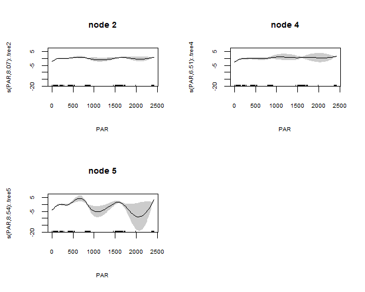
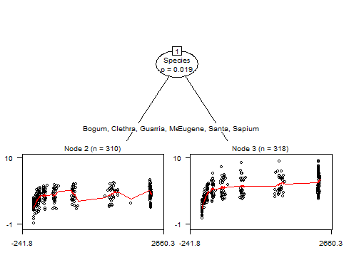
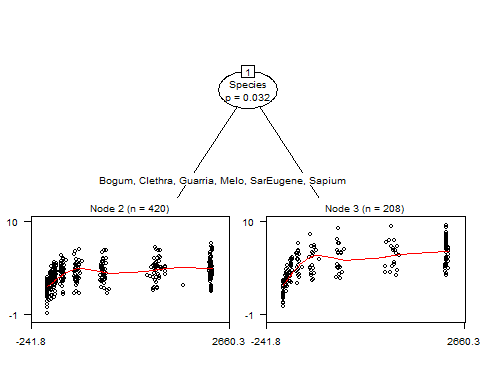

# gamtree: Generalized additive model (GAM) trees

Functions for detection and identification of subgroups in GAMs. The GAM
can comprise any number of smooth and parametric terms, and the
subgroups of interest may differ in terms of the effect of a single or
multiple predictors. The effects of parameters of interest for the GAM,
and for the subgroup detection in specific, can be flexibly defined by
the user.

For fitting the smooth and parametric terms, package **mgcv** is
employed. For recursive partitioning, package **partykit** is employed.
The **gamtree** package is experimental. 

The current version of the package can be installed as follows:

``` r
library("devtools")
install_github("marjoleinF/gamtree")
```

# Examples

First, we load the package:

``` r
library("gamtree")
```

Next, we load an example dataset to illustrate the functionality of
package **gamtree**:

``` r
data(eco)
summary(eco)
#>     Species         PAR               Pn           cluster_id 
#>  Bogum  : 96   Min.   :   0.0   Min.   :-0.950   8      : 41  
#>  Clethra: 75   1st Qu.: 108.7   1st Qu.: 2.990   4      : 37  
#>  Eugene :101   Median : 458.8   Median : 4.050   11     : 37  
#>  Guarria: 92   Mean   : 975.0   Mean   : 4.131   14     : 37  
#>  Melo   : 47   3rd Qu.:2376.4   3rd Qu.: 5.082   6      : 35  
#>  Santa  :110   Max.   :2418.5   Max.   : 9.500   10     : 35  
#>  Sapium :107                                     (Other):406  
#>      noise             specimen    
#>  Min.   :-3.00805   Min.   : 2.00  
#>  1st Qu.:-0.77022   1st Qu.:14.00  
#>  Median :-0.05190   Median :25.00  
#>  Mean   :-0.03934   Mean   :25.81  
#>  3rd Qu.: 0.68309   3rd Qu.:38.00  
#>  Max.   : 3.81028   Max.   :48.00  
#> 
```

The data contain 628 observations. The `Species` variable is an
indicator for plant species. Variable `PAR` will be used as a predictor
for the node-specific model, variable `Pn` as the response. Variables
`cluster_id` and `noise` are in fact noise variables, but will be used
to specify global model terms, to illustrate their use. Finally,
`specimen` is an indicator for individual plants.

## Specifying the model formula

The model is specified through a three- or four-part formula, comprising
a response variable, local (subgroup-specific) terms, partitioning
variables and global terms. Informally written, a full four-part GAM
tree formula can be described as:

``` r
response ~ local terms | global terms | partitioning variables
```

The response must be a single variable; continuous, count, binomial
variables are currently supported. The local terms, separated from the
response by a tilde (`~`), can comprise one or more smooth and/or
parametric terms, as they would be specified in a model fitted with
`gam()`. The global terms, separated from the local terms comprise one
or more smooth and/or parametric terms, as they would be specified in a
model fitted with `gam()`. The partitioning variables, separated from
the global terms by a vertical bar(`|`), are specified by providing
their names. One can think of this GAM tree formulation as: the effects
of the local terms are estimated, conditional on the estimated global
terms, conditional on a subgroup structure based on the partitioning
variables.

It is not required to specify the global terms: they can simply be
omitted by specifying only a two-part left-hand side. This yields a
model with an estimated partition (subgroup structure) with
subgroup-specific estimates of the (local) terms, without any global
terms. The formula can then be described as:

``` r
response ~ local terms | partitioning variables
```

## GAM-based recursive partition without global effects

We first fit a GAM-based recursive partition without global effects. We
specify `Pn` as the response, with a smooth effect of `PAR`. We specify
`Species` as the only potential partitioning variable. Furthermore, we
specify the `cluster` argument, which will be passed to the recursive
partitioning procedure (function `mob()` from package **partykit**) to
indicate that the individual observations in the dataset are not
independent, but nested within the different specimen.

``` r
gt1 <- gamtree(Pn ~ s(PAR) | Species, data = eco, cluster = eco$specimen)
```

We can inspect the partition by plotting the tree (see `?plot.gamtree`
for more info):

``` r
plot(gt1, which = "tree", treeplot_ctrl = list(gp = gpar(cex = .5)))
```


Through the `treeplot_ctrl` argument, we can specify additional argument
to be passed to function `plot.party()` (from package **partykit**). We
passed the `gp` argument, to have a smaller font size for the node and
path labels than with the default `cex = 1`.

The plots indicate similar trajectories in all three terminal nodes,
revealing a sharp increase first, which then levels off. The increase
appears to level off completely in node 2, while the increase in nodes 4
and 5 only slows down towards the right end.

Note that the red curves represent the fitted (predicted) values of the
observations. They are not very smooth, because they reflect marginal
effects, which can be strongly influenced by where data was observed,
combined with the effects of other variables. We can also plot
conditional effects (i.e., keeping all other predictors fixed) of the
predictors:

``` r
par(mfrow = c(2, 2))
plot(gt1, which = "terms", which_terms = "local", 
     gamplot_ctrl = list(shade = TRUE, cex.main = .8, cex.axis = .6, cex.lab = .6))
```



We used the `gamplot_ctrl` argument to pass additional arguments to
function `plot.gam()` (from package **mgcv**). We specified the `shade`
argument, so that the confidence interval are depicted with a grey
shaded area. Note however, that the plotted confidence intervals are
overly optimistic, because they do not account for the searching of the
tree (subgroup) structure.

## GAM-based recursive partition with global effects

We will now include a global part in the fitted model. We add global
terms to the earlier `gamtree` model, based on the `noise` and
`cluster_id` variables. Both are in fact noise variables, so these
should not have significant or substantial effects. They merely serve as
an illustration of how to specify a global (i.e., subgroup-invariant)
part of the model. We will specify `noise` as having a parametric (i.e.,
linear) effect and `cluster_id` as an indicator for a random intercept
term (which can be fitted using function `s()` and specifying
`bs = "re"`).

To estimate both the local and global models, an iterative approach is
taken:

-   Step 0: Initialize by assuming the global effects to be zero.

-   Step 1: Given the current estimate of the global effects, estimate
    the partition (subgroup structure).

-   Step 2: Given the current estimate of the partition (subgroup
    structure), estimate the local and global effects.

-   Step 3: Repeat steps 1 and 2 until convergence (i.e., change in
    log-likelihood values from one iteration to the next is smaller than
    `abstol`).

Note that in Step 0, the assumption of global effects being zero can be
replaced with an assumption of there being no subgroups. This can be
specified through use of the `globalstart` argument. The only difference
is then, that estimation of the model will initialize with Step 2.

``` r
gt2 <- gamtree(Pn ~ s(PAR) | noise + s(cluster_id, bs="re") | Species,
               data = eco, cluster = eco$specimen)
gt2$iterations
#> [1] 2
```

Estimation converged in two iterations. Probably because accounting for
the global effects has little effect: the predictors for the global
model are in fact noise variables, the global effects are thus 0 and the
initial estimate of the global effects is already adequate.

We can obtain test statistics for the significance of the global and
local effects in the full GAM using the `summary` method:

``` r
summary(gt2)
#> 
#> Family: gaussian 
#> Link function: identity 
#> 
#> Formula:
#> Pn ~ .tree + s(PAR, by = .tree) + noise + s(cluster_id, bs = "re") - 
#>     1
#> 
#> Parametric coefficients:
#>         Estimate Std. Error t value Pr(>|t|)    
#> .tree2  3.704214   0.063878  57.989   <2e-16 ***
#> .tree4  4.709721   0.120736  39.009   <2e-16 ***
#> .tree5  5.288446   0.119991  44.074   <2e-16 ***
#> noise  -0.003047   0.044132  -0.069    0.945    
#> ---
#> Signif. codes:  0 '***' 0.001 '**' 0.01 '*' 0.05 '.' 0.1 ' ' 1
#> 
#> Approximate significance of smooth terms:
#>                 edf Ref.df      F p-value    
#> s(PAR):.tree2 8.136  8.779 27.621  <2e-16 ***
#> s(PAR):.tree4 6.532  7.612 15.197  <2e-16 ***
#> s(PAR):.tree5 8.520  8.897 31.232  <2e-16 ***
#> s(cluster_id) 5.863 20.000  0.404   0.126    
#> ---
#> Signif. codes:  0 '***' 0.001 '**' 0.01 '*' 0.05 '.' 0.1 ' ' 1
#> 
#> R-sq.(adj) =  0.572   Deviance explained = 93.9%
#> GCV = 1.3767  Scale est. = 1.3043    n = 628
```

Note that the standard errors and degrees of freedom for the smooth and
parametric terms in the terminal nodes (i.e., those terms containing
`.tree`) do not account for the searching of the tree structure and are
therefore likely too low (overly optimistic), yielding too low standard
errors and *p* values.

The effect of the local smooths are significant in every terminal tree
node (again, these *p* values are overly optimistic). As expected, the
global fixed and random effects (`noise` and `s(cluster_id)`) are not
significant. We will also see this in their estimated random-effects
coefficients being close to zero:

``` r
coef(gt2, which = 'global')
#>            noise  s(cluster_id).1  s(cluster_id).2  s(cluster_id).3 
#>     -0.003047441     -0.008674167      0.042105978     -0.036189299 
#>  s(cluster_id).4  s(cluster_id).5  s(cluster_id).6  s(cluster_id).7 
#>     -0.049712331     -0.098617797      0.005462097      0.051710536 
#>  s(cluster_id).8  s(cluster_id).9 s(cluster_id).10 s(cluster_id).11 
#>     -0.113024023      0.094820532     -0.029792470      0.034134724 
#> s(cluster_id).12 s(cluster_id).13 s(cluster_id).14 s(cluster_id).15 
#>      0.078520126     -0.013173338     -0.063299134      0.124354355 
#> s(cluster_id).16 s(cluster_id).17 s(cluster_id).18 s(cluster_id).19 
#>     -0.080836468      0.133251777      0.092947013     -0.076822763 
#> s(cluster_id).20 s(cluster_id).21 
#>     -0.031911034     -0.055254312
```

Note that by default, the `coef` method returns the local
(node-specific) estimates, but we obtained the global coefficient
estimates only through specifying the `which` argument (see also
`?coef.gamtree`).

We can plot the tree and the models fitted in each of the terminal
nodes:

``` r
plot(gt2, which = "tree", treeplot_ctrl = list(gp = gpar(cex = .5)))
```


``` r
par(mfrow = c(2, 2))
plot(gt2, which = "terms", gamplot_ctrl = list(shade = TRUE, cex.main = .8, 
                                               cex.axis = .6, cex.lab = .6))
```


## Evaluating the adequacy of the basis used to represent the smooth terms

The plots indicate that the lines of the fitted smooths are somewhat
wiggly, especially in node 2. Perhaps the default dimension for the
basis used to represent the smooth term, `k = 9`, may not be adequate
for these data. In addition to the above visual inspection of how well
the smooths appear to approximate the datapoints, we can use the
`gam.check()` function from package **mgcv** to check the adequacy of
the dimension of the basis used to represent the smooth term:

``` r
gam.check(gt2$gamm)
#> 
#> Method: GCV   Optimizer: magic
#> Smoothing parameter selection converged after 21 iterations.
#> The RMS GCV score gradient at convergence was 5.447511e-07 .
#> The Hessian was positive definite.
#> Model rank =  52 / 52 
#> 
#> Basis dimension (k) checking results. Low p-value (k-index<1) may
#> indicate that k is too low, especially if edf is close to k'.
#> 
#>                  k'   edf k-index p-value  
#> s(PAR):.tree2  9.00  8.14    0.92   0.015 *
#> s(PAR):.tree4  9.00  6.53    0.92   0.030 *
#> s(PAR):.tree5  9.00  8.52    0.92   0.020 *
#> s(cluster_id) 21.00  5.86      NA      NA  
#> ---
#> Signif. codes:  0 '***' 0.001 '**' 0.01 '*' 0.05 '.' 0.1 ' ' 1
```

By default, `gam.check()` also yields residual plots, which are omitted
here. The values of `k-index` and `p-value` above indicate that the
default `k = 9` may be too low. This is in contrast with the somewhat
too wiggly pattern of the smooths we observed in the plots of the smooth
terms and datapoints, which suggests the value of `k` may be too high.

Based on the `gam.check()` function results, we could increase the value
of `k`, to see if that increases the reported `edf` substantially:

``` r
gt3 <- gamtree(Pn ~ s(PAR, k=18L) | noise + s(cluster_id, bs = "re") | Species, 
               data = eco, cluster = eco$specimen)
plot(gt3, which = "tree", treeplot_ctrl = list(gp = gpar(cex = .5)))
```



We obtained a tree with a single split. Increased flexibility of the
smooth curves seems to have accounted for the difference between Eugene
and Sapium we saw in the earlier tree. Otherwise, the results seem the
same as before: The response variable values appear somewhat lower at
the start in node 2, compared to node 3. This difference seems to have
increased at the last measurements.

We again apply the `gam.check()` function:

``` r
gam.check(gt3$gamm)
#> 
#> Method: GCV   Optimizer: magic
#> Smoothing parameter selection converged after 6 iterations.
#> The RMS GCV score gradient at convergence was 2.05892e-07 .
#> The Hessian was positive definite.
#> Model rank =  58 / 58 
#> 
#> Basis dimension (k) checking results. Low p-value (k-index<1) may
#> indicate that k is too low, especially if edf is close to k'.
#> 
#>                  k'   edf k-index p-value  
#> s(PAR):.tree2 17.00  9.42    0.93   0.035 *
#> s(PAR):.tree3 17.00  8.11    0.93   0.030 *
#> s(cluster_id) 21.00  7.51      NA      NA  
#> ---
#> Signif. codes:  0 '***' 0.001 '**' 0.01 '*' 0.05 '.' 0.1 ' ' 1
```

The `edf` values have not increased substantially and the `k-index`
values are similar to the earlier values. Thus, increasing the number of
knots to a larger number than the default seems not necessary.

We can also *reduce* the value of `k` to see if that yields less wiggly
lines, and perhaps a different tree:

``` r
gt4 <- gamtree(Pn ~ s(PAR, k=5L) | noise + s(cluster_id, bs="re") | Species,
               data = eco, cluster = eco$specimen, verbose = FALSE)
plot(gt4, which = "tree", treeplot_ctrl = list(gp = gpar(cex = .5)))
```


``` r
par(mfrow = c(2, 2))
plot(gt4, which = "terms", gamplot_ctrl = list(shade = TRUE, cex.main = .8, 
                                               cex.axis = .6, cex.lab = .6))
```


To the eye, a lower value dimension for the bases to represent the
smooth terms seems more appropriate; the lower flexibility leads less
wiggly lines. The lower value for `k` does not seem to yield a different
tree or conclusions anyway. So we will stick with the value of `k = 5`.

## Further inspection of the fitted model

We obtain a summary of the fitted full GAM using the `summary` method:

``` r
summary(gt4)
#> 
#> Family: gaussian 
#> Link function: identity 
#> 
#> Formula:
#> Pn ~ .tree + s(PAR, k = 5, by = .tree) + noise + s(cluster_id, 
#>     bs = "re") - 1
#> 
#> Parametric coefficients:
#>        Estimate Std. Error t value Pr(>|t|)    
#> .tree2 3.705306   0.066882  55.401   <2e-16 ***
#> .tree3 4.954916   0.090711  54.623   <2e-16 ***
#> noise  0.002525   0.046758   0.054    0.957    
#> ---
#> Signif. codes:  0 '***' 0.001 '**' 0.01 '*' 0.05 '.' 0.1 ' ' 1
#> 
#> Approximate significance of smooth terms:
#>                 edf Ref.df      F p-value    
#> s(PAR):.tree2 3.934  3.996 44.540  <2e-16 ***
#> s(PAR):.tree3 3.943  3.997 71.043  <2e-16 ***
#> s(cluster_id) 4.993 20.000  0.328   0.165    
#> ---
#> Signif. codes:  0 '***' 0.001 '**' 0.01 '*' 0.05 '.' 0.1 ' ' 1
#> 
#> R-sq.(adj) =  0.505   Deviance explained = 92.7%
#> GCV = 1.5481  Scale est. = 1.509     n = 628
```

Note that the standard errors and degrees of freedom for the smooth and
parametric terms in the terminal nodes (i.e., those terms containing
`.tree`) do not account for the searching of the tree structure and are
therefore likely too low (overly optimistic), yielding too low *p*
values.

The `Parameteric coefficients` indicate that the intercepts in every
terminal node are significantly different from 0. In light of the
standard errors, the differences in intercepts also seem significant.
Thus, the starting values appear highest in node 5, and lowest in node
2.

The `Approximate significance of smooth terms` indicate significance of
the smooth terms in all three terminal nodes.

Using the `coef` method we can print the coefficients from the terminal
nodes:

``` r
coef(gt4)
#>   (Intercept)  s(PAR).1   s(PAR).2 s(PAR).3 s(PAR).4
#> 2    3.705306 -1.969473  -7.701159 6.119865 3.120238
#> 3    4.954916 -3.215327 -11.095423 8.926559 5.181505
```

We can do an additional check on the observation-level contributions to
the gradient. We can do this using the `check_grad()` function. It
computes the sum of the observation-wise contributions to the gradient.
These sums should be reasonably close to zero:

``` r
check_grad(gt4)
#>     (Intercept)    s(PAR).1   s(PAR).2    s(PAR).3      s(PAR).4
#> 1  1.090544e-12 -0.09819859 -0.1477924 -0.02848232 -2.056674e-12
#> 2 -1.463320e-12 -0.09638620 -0.1707915 -0.03246162 -2.934272e-13
#> 3 -2.419072e-14  0.08936639  0.1123353 -0.01591724  9.671812e-13
```

The sum of the gradient contributions seem reasonably close to zero.

## Specifying non-default arguments for the partitioning

Let’s say would prefer to collapse nodes 4 and 5, because we do not
think the differences between the two species are relevant. We can do
that through specifying the `maxdepth` argument of function `mob()`,
which is used internally by function `gamtree()` to perform the
partitioning (splitting). We can pass additional arguments to function
`mob()` with the `mob_ctrl` argument:

``` r
gt5 <- gamtree(Pn ~ s(PAR, k=5L) | Species, data = eco, cluster = eco$specimen, 
               mob_ctrl = mob_control(maxdepth = 2L))
```

Note that function `mob_control()` (from package **partykit**) is used
here, to generate a `list` of control arguments for function `mob()`.

We inspect the result:

``` r
plot(gt5, which = "tree", treeplot_ctrl = list(gp = gpar(cex = .5)))
```



We can again check whether the sums of the observation-wise gradient
contributions are reasonably close to zero:

``` r
check_grad(gt5)
#>     (Intercept)    s(PAR).1   s(PAR).2    s(PAR).3      s(PAR).4
#> 1  3.637923e-13 -0.09585712 -0.1470034 -0.02843551 -3.881347e-12
#> 2 -2.455432e-12 -0.09300438 -0.1695259 -0.03259946  1.876023e-13
#> 3 -4.673037e-13  0.08903445  0.1126072 -0.01573966  1.009860e-12
```

the observation-wise gradient contributions sum to values reasonably
close to 0.

## Specifying multiple terms and/or predictors for the node-specific GAMs

Multiple predictor variables can be specified for the node-specific
model, as is customary with function `gam()`. Parametric as well as
non-parametric terms can be specified, both for the global as well as
for the local terms. But note that specifying more than a small number
of terms for the node-specific models is probably not a good idea; it
will yield results which are difficult to interpret (because of the
large number of coefficients) and possibly unstable, or may lead to
estimation errors. The higher the complexity (i.e., the higher the df
for the smooth term, the higher the number of predictor variables) of
the node-specific model, the more likely that one or more spurious
subgroups will be detected, or actual subgroups may be obfuscated.

Specifying a predictor for the node-specific model which is known to be
noise is not a good idea in the real world, but here we do it anyway for
illustration purposes. We add a parametric (i.e., linear) effect of
`noise` in the node-specific model:

``` r
gt6 <- gamtree(Pn ~ s(PAR, k=5L) + noise | s(cluster_id, bs="re") | Species,
               data = eco, cluster = eco$specimen)
#> Warning in gamtree(Pn ~ s(PAR, k = 5L) + noise | s(cluster_id, bs = "re") | : It
#> appears more than 1 term has been specified for the node-specific (local) GAM.
#> This may lead to unexpected results.
summary(gt6)
#> 
#> Family: gaussian 
#> Link function: identity 
#> 
#> Formula:
#> Pn ~ s(PAR, k = 5) + noise + s(cluster_id, bs = "re")
#> 
#> Parametric coefficients:
#>             Estimate Std. Error t value Pr(>|t|)    
#> (Intercept)  4.13331    0.06287  65.739   <2e-16 ***
#> noise        0.03472    0.05285   0.657    0.511    
#> ---
#> Signif. codes:  0 '***' 0.001 '**' 0.01 '*' 0.05 '.' 0.1 ' ' 1
#> 
#> Approximate significance of smooth terms:
#>                 edf Ref.df      F p-value    
#> s(PAR)        3.959  3.999 87.086  <2e-16 ***
#> s(cluster_id) 4.042 20.000  0.251   0.216    
#> ---
#> Signif. codes:  0 '***' 0.001 '**' 0.01 '*' 0.05 '.' 0.1 ' ' 1
#> 
#> R-sq.(adj) =  0.358   Deviance explained = 36.8%
#> GCV = 1.9854  Scale est. = 1.9538    n = 628
```

We can also employ different functions than `s()` for the node-specific
(or global) GAMs:

``` r
gt9 <- gamtree(Pn ~ te(PAR, noise) | s(cluster_id, bs="re") | Species,
               data = eco, mob_ctrl = mob_control(maxdepth = 3L))
summary(gt9)
#> 
#> Family: gaussian 
#> Link function: identity 
#> 
#> Formula:
#> Pn ~ .tree + te(PAR, noise, by = .tree) + s(cluster_id, bs = "re") - 
#>     1
#> 
#> Parametric coefficients:
#>        Estimate Std. Error t value Pr(>|t|)    
#> .tree2  3.54570    0.07779   45.58   <2e-16 ***
#> .tree3  4.68573    0.07734   60.59   <2e-16 ***
#> ---
#> Signif. codes:  0 '***' 0.001 '**' 0.01 '*' 0.05 '.' 0.1 ' ' 1
#> 
#> Approximate significance of smooth terms:
#>                         edf Ref.df      F p-value    
#> te(PAR,noise):.tree2  8.056  8.637 13.114  <2e-16 ***
#> te(PAR,noise):.tree3 12.384 14.002 29.285  <2e-16 ***
#> s(cluster_id)         6.724 20.000  0.504  0.0756 .  
#> ---
#> Signif. codes:  0 '***' 0.001 '**' 0.01 '*' 0.05 '.' 0.1 ' ' 1
#> 
#> R-sq.(adj) =  0.521   Deviance explained = 93.1%
#> GCV = 1.5285  Scale est. = 1.4575    n = 628
```
