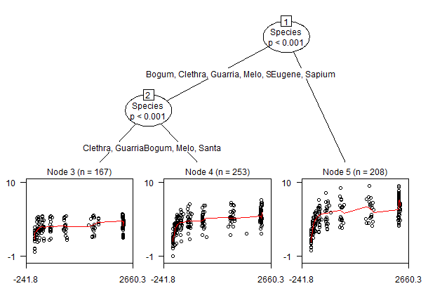
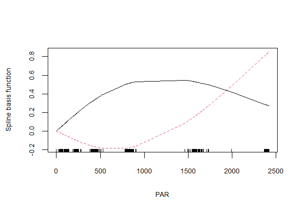

# gamtree: generalized additive model (GAM) trees

## Introduction

Package **gamtree** offers functionality for detection and
identification of subgroups with differently shaped effects in GAMs. It 
provides two main functions:

-   `splinetree` for partitioning unpenalized or parametric splines (e.g.,
    cubic and natural splines), package **glmertree** is used for estimation and
    partitioning, and package **splines** (or **mgcv**, will be supported in future versions) is used for
    setting up the spline bases.

-   `gamtree` for partitioning penalized or semi-parametric splines (i.e.,
    *smoothing* splines), package **gamm4** is used for estimation and
    packages **partykit** and **merDeriv** are used for partitioning.

Package **gamtree** is still under development. The current version of
the package can be installed as follows:

``` r
library("devtools")
install_github("marjoleinF/gamtree")
```

## Example data

First, we load the package:

``` r
library("gamtree")
```

Next, we load an example dataset to illustrate the functionality of
package **gamtree**:

``` r
data(eco)
summary(eco)
#>     Species         PAR               Pn            Specimen  
#>  Bogum  : 96   Min.   :   0.0   Min.   :-0.950   30     : 14  
#>  Clethra: 75   1st Qu.: 108.7   1st Qu.: 2.990   14     : 13  
#>  Eugene :101   Median : 458.8   Median : 4.050   19     : 13  
#>  Guarria: 92   Mean   : 975.0   Mean   : 4.131   20     : 13  
#>  Melo   : 47   3rd Qu.:2376.4   3rd Qu.: 5.082   53     : 13  
#>  Santa  :110   Max.   :2418.5   Max.   : 9.500   12     : 12  
#>  Sapium :107                                     (Other):550  
#>      noise         
#>  Min.   :-2.99309  
#>  1st Qu.:-0.64796  
#>  Median :-0.02591  
#>  Mean   :-0.01607  
#>  3rd Qu.: 0.65378  
#>  Max.   : 3.22907  
#> 
```

The data comprises light-response curves, which describe the
relationship between photosynthetically active radiation (`PAR`) and
photosynthetic rate (`Pn`). There are 628 observations. The `Species`
variable is an indicator for plant species. Variable `PAR` will be used
as the predictor for the node-specific model, variable `Pn` as the
response. Observations are repeated measures on the same plants.
Variable `Specimen` provides an identifier for individual plants.
Variable `noise` is artificially generated, independent from all other
variables in the dataset. It will be used here to illustrate the trees
can successfully distinguish signal from noise.

## Subgroup detection in parametric splines

Function `splinetree` allows for partitioning parametric splines (e.g.,
cubic and natural splines). It uses package **glmertree** for estimation
and partitioning, and package **splines** or **mgcv** for setting up the
spline bases.

### Specifying the model formula

The model is specified through a four-part formula, following the same
format as `lmertree` or `glmertree`. The four-part formula comprises a
response variable, local subgroup-specific effects, global effects and
partitioning variables. Informally written, it the model formula has the
form:

``` r
response ~ local term | global terms | partitioning variables
```

The response must be a single variable. Continuous, count, binomial
variables and other responses are supported through specification of the
`family` argument. The local term, separated from the response by a
tilde (`~`) for GAM trees will comprise spline terms. Although splines
can in principle be specified for multiple predictors, it is advised to
restrict the local terms to only a spline of only a single predictor of
interest.

The global terms, separated from the local term comprise one or more
smooth and/or parametric (fixed or random) terms, as they would be
specified in a model fitted with functions `lmer` or `glmer` (from
package **lme4**). The partitioning variables, separated from the global
terms by a vertical bar(`|`), are specified by their names, separated by
`+` signs:

While functions `lmertree` and `glmertree` do allow for specifying
splines directly in the model formula, it is
likely beneficial to restrict the knot locations to be identical between
all terminal nodes. As a result, the combined spline models in the child
nodes of a parent node will be nested. Fixing the knot locations reduces the
risk of overfitting, which is likely beneficial when splines and
recursive partitioning are combined. As Eilers and Marx (1996) already
noted in the context of splines: “The choice of knots has been a subject
of much research: too many knots lead to overfitting of the data, too
few knots lead to underfitting.”

Function `splinetree` first estimates the knot locations from the full
dataset, so that the same knots can subsequently be used in all
subgroups or nodes. It allows splines to be specified as would normally
be done with functions `ns` or `bs`:

``` r
st <- splinetree(Pn ~ ns(PAR, df = 5) | (1|Specimen) | Species, data = eco, 
                 cluster = Specimen)
```

The first argument (`formula`) specied that response `Pn` should be
regressed on a 2-df natural spline of `PAR`, that a global random
intercept term should be estimated with respect to `Specimen` and that
stability of the effect of `PAR` should be assessed with respect to
`Species`.

Often, the partitioning variables may not be measured on the level of
individual observations. In the current dataset, observations are
clustered within individual plants (indicated by `Specimen`). The
partitioning variable of interest (`Species`) is also measured on that
level. Thus, we must also indicate that parameter stability tests must
be performed on that level through use of the `cluster` argument. For an
extensive discussion of the levels at which parameter stability tests
are performed, see Fokkema & Zeileis (in press).

We can plot the resulting tree using the `plot` method. We use the `gp`
argument to adjust the value of graphical parameters (see `?gpar` for a
list of changeable parameters), here we use it to impove readability of
the plot by reducing the size of plotting symbols:

``` r
plot(st, which = "tree", gp = gpar(cex = .6))
```


The resulting tree suggests that Eugene and Sapium plants have the
strongest reaction in terms of photosynthetic rate (`Pn`) to increased
photosynthetically active radiation (`PAR`).

Although individual spline coefficients are difficult to interpret, they
can be obtained using the `coef` method:

``` r
coef(st)
#>   (Intercept) spline.PAR1 spline.PAR2 spline.PAR3 spline.PAR4 spline.PAR5
#> 3    1.802804    1.427942    1.856243    1.966322    3.296261   0.7855231
#> 4    1.406797    2.692490    3.345742    3.217900    5.464235   1.5846942
#> 6    2.008309    2.317537    3.938537    2.637493    5.976345   2.2783475
#> 7    1.363507    4.885255    5.333215    5.013405    8.445352   2.9425599
```

Finally, using the `predict` method, we can obtain predictions for (new)
observations:

``` r
predict(st, newdata = eco[1:5,])  
#>          1          2          3          4          5 
#> -0.8957505  0.5387826  1.2428838  1.7959293  1.8927217
```

### Choosing and evaluating the spline basis

As hinted at with the quote from Eilers and Marx (1996), choosing a good
spline basis can be challenging. It may be helpful to inspect the
spline bases that were set up to evaluate, for example, whether the bases have
optimal resolution and spacing in specific areas of interest. This 
can be done though visual inspection of the fitted curves in the 
terminal nodes. Alternatively, the individual spline basis functions can be
be inspected as follows:

``` r
sb <- st$data$spline.PAR
x <- st$data$PAR
```

Note that the name of the spline basis is always starts with `spline.`, followed by
the name of the predictor variable of interest. For plotting the spline bases, it is also necessary to
extract the original values of the predictor variable of interest
(`x`).

``` r
matplot(x = x[order(x)], y = sb[order(x),], cex.lab =.7, cex.axis = .7,
        type = "l", xlab = "PAR", ylab = "Spline basis function")
rug(x)
```


Choosing a more complex spline basis increases flexibility, but may also
make the fitted curves too wiggly. For example, a cubic spline with
more degrees of freedom yields wigglyness especially at the boundaries
of the predictor variable space:

``` r
st2 <- splinetree(Pn ~ bs(PAR, df = 15) | (1|Specimen) | Species, data = eco, 
                 cluster = Specimen)
plot(st2, which = "tree", gp = gpar(cex = .6))
```



``` r
sb <- st2$data$spline.PAR
x <- st2$data$PAR
matplot(x = x[order(x)], y = sb[order(x),], cex.lab =.7, cex.axis = .7,
        type = "l", xlab = "PAR", ylab = "Spline basis function")
rug(x)
```


But note that the detected subgroups may actually be quite insensitive
to different but reasonable choices of the degrees of freedom:

``` r
st3 <- splinetree(Pn ~ ns(PAR, df = 2) | (1|Specimen) | Species, data = eco, 
                 cluster = Specimen)
plot(st3, which = "tree", gp = gpar(cex = .6))
```


``` r
sb <- st3$data$spline.PAR
x <- st3$data$PAR
matplot(x = x[order(x)], y = sb[order(x),], cex.lab =.7, cex.axis = .7,
        type = "l", xlab = "PAR", ylab = "Spline basis function")
rug(x)
```



This results in the same subgroup structure as before, but with less
flexible curves.

## Subgroup detection in penalized or smoothing splines

Function `gamtree` allows for partitioning penalized non-parametric
splines (i.e., *smoothing* splines). It uses package **gamm4** for
estimation, package **merDeriv** to obtain derivatives used in the
parameter stability tests used by package **partykit** for partitioning.

Package **gamm4** allows for specifying and fitting GAMs just like
package **mgcv** does, but makes the connection between GAMs and
mixed-effects models explicit, allowing for performing model-based
recursive partitioning for subgroup detection. The core difference with
function `splinetree` is that `gamtree` is based on penalized or
smoothing splines. Smoothing splines require estimation of a smoothing
parameter, which controls the wigglyness of the fit. With parametric
splines, the wigglyness is determined by the user through the choice of
spline basis and number and location of knots. With smoothing splines,
the optimal amount of wigglyness is estimated in a data-driven manner.
Thus, users have to worry less about the choice of basis and
number and location of knots. Furthermore, function `gamtree` allows the
amount of wigglyness to be a critical factor in subgroup detection.

The smoothing parameter can be seen as a random-effects parameter in a
mixed-effects model. This view allows to incorporate the smoothing
parameter into the parameter stability tests performed in model-based
recursive partitioning.

The computational burden of fitting smoothing splines can be much
heavier than of fitting parametric splines. Similarly, function
`gamtree` is has substantially higher computational load than function `splinetree`. Yet,
`gamtree` does not require the user to choose a fixed value for the
degrees of freedom of the spline, but selects the optimal value of the
smoothing parameter in a data-driven manner. A disadvantage of `gamtree` is
that it does not allow for keeping the spline bases identical between nodes.
Yet, in case of substantial shape differences between subgroups, this might
also be an advantage.

### Specifying the model formula

The model is specified through a three-part formula, comprising a
response variable, local (subgroup-specific) effects, and one or more
partitioning variables. Informally written, a three-part GAM tree
formula has the form:

``` r
response ~ local term | partitioning variables
```

The response must be a single variable. Continuous, count, binomial
variables and other responses are supported through specification of the
`family` argument. The local term, separated from the response by a
tilde (`~`), generally comprises a single smooth term. Although multiple
smooths or predictors can in principle be specified for the local part,
it is advised to restrict this part to only a single smooth or predictor
of interest.

Again we specify `Pn` as the response, regressed on a smoothing spline of
`PAR`, and we specify `Species` as the only potential partitioning
variable. Furthermore, we specify the `cluster` argument, to account for
the fact that individual observations are nested within plants:

``` r
gt <- gamtree(Pn ~ s(PAR, k = 5) | Species, data = eco, cluster = Specimen)
```

We can inspect the partition by plotting the tree (see `?plot.gamtree`
for more info):

``` r
plot(gt, which = "tree", treeplot_ctrl = list(gp = gpar(cex = .5)))
```


Through the `treeplot_ctrl` argument, we can specify additional argument
to be passed to function `plot.party()` (from package **partykit**). We
passed the `gp` argument, to have a smaller font size for the node and
path labels (the default is `cex = 1`).

The plots indicate similar trajectories in all three terminal nodes,
revealing a sharp increase first, which then levels off. The increase
appears to level off completely in node 2, while the increase in nodes 4
and 5 only slows down towards the right end.

Note that the red curves represent the fitted (predicted) values of the
observations. They are not very smooth, because they reflect marginal
effects, which can be strongly influenced by where data was observed (or
not), combined with the effects of other variables.

We can therefore also plot conditional effects (i.e., keeping values of all other
predictors fixed at the same value, often zero) of the predictors:

``` r
par(mfrow = c(2, 2))
plot(gt, which = "terms",
     gamplot_ctrl = list(shade = TRUE, cex.main = .8, cex.axis = .6, cex.lab = .6))
```


We used the `gamplot_ctrl` argument to pass additional arguments to
function `plot.gam()` (from package **mgcv**). We specified the `shade`
argument, so that the confidence intervals are depicted with a grey
shaded area. Note however, that the plotted confidence intervals are
overly optimistic, because they do not account for the searching of the
tree (subgroup) structure.

## Print, plot, predict and other methods

We can print the fitted tree to see a summary:

``` r
gt$tree
#> Model-based recursive partitioning (gamfit)
#> 
#> Model formula:
#> Pn ~ PAR | Species
#> 
#> Fitted party:
#> [1] root
#> |   [2] Species in Clethra, Eugene, Santa
#> |   |   [3] Species in Clethra, Eugene: n = 176
#> |   |       $fixef
#> |   |       X(Intercept)   Xs(PAR)Fx1 
#> |   |           4.052102     2.314271 
#> |   |       
#> |   |       $ranef
#> |   |        Groups   Name   Std.Dev.
#> |   |        Xr       s(PAR) 5.4729  
#> |   |        Residual        1.4803  
#> |   |       
#> |   |   [4] Species in Santa: n = 110
#> |   |       $fixef
#> |   |       X(Intercept)   Xs(PAR)Fx1 
#> |   |           4.154818     3.607554 
#> |   |       
#> |   |       $ranef
#> |   |        Groups   Name   Std.Dev.
#> |   |        Xr       s(PAR) 13.6332 
#> |   |        Residual         1.0923 
#> |   |       
#> |   [5] Species in Bogum, Guarria, Melo, Sapium: n = 342
#> |       $fixef
#> |       X(Intercept)   Xs(PAR)Fx1 
#> |           4.163567     4.214203 
#> |       
#> |       $ranef
#> |        Groups   Name   Std.Dev.
#> |        Xr       s(PAR) 14.1809 
#> |        Residual         1.4486 
#> |       
#> 
#> Number of inner nodes:    2
#> Number of terminal nodes: 3
#> Number of parameters per node: 2
#> Objective function: -1115.682
```

Furthermore, methods `predict`, `plot`, `coef`, `fixef`, `ranef`,
`VarCorr` can be applied to inspect the fitted GAM tree model:

``` r
predict(gt, newdata = eco[1:5, ])
#>        1        2        3        4        5 
#> 2.211772 2.719966 3.087852 4.085215 5.080678
coef(gt)
#>   (Intercept)      PAR
#> 3    4.052102 2.314271
#> 4    4.154818 3.607554
#> 5    4.163567 4.214203
fixef(gt)
#>   (Intercept)      PAR
#> 3    4.052102 2.314271
#> 4    4.154818 3.607554
#> 5    4.163567 4.214203
ranef(gt)
#>   s(PAR).b1  s(PAR).b2 s(PAR).b3
#> 3  5.283009  -4.107248  -4.03760
#> 4 -3.414028 -16.117238 -15.39675
#> 5 -5.095512 -18.418761 -14.48049
VarCorr(gt)
#> $`node 3`
#>            var1 var2      vcov    sdcor
#> Smooth   s(PAR) <NA> 29.953036 5.472937
#> Residual   <NA> <NA>  2.191305 1.480306
#> 
#> $`node 4`
#>            var1 var2       vcov     sdcor
#> Smooth   s(PAR) <NA> 185.864837 13.633225
#> Residual   <NA> <NA>   1.193063  1.092274
#> 
#> $`node 5`
#>            var1 var2       vcov     sdcor
#> Smooth   s(PAR) <NA> 201.098651 14.180926
#> Residual   <NA> <NA>   2.098341  1.448565
```

## Partitioning method and computational speed

By default, model-based recursive partitioning (Zeileis et al., 2008) is
used for fitting the tree. Yet, this yields a rather heavy computational
load for penalized spline models. Therefore, function `gamtree` also
allows to employ conditional inference trees (or `ctree`; Hothorn et
al., 2006) to fit the tree. This algorithm uses slightly different
criteria for variable and split selection. The resulting tree structures 
are generally similar, but may often not be identical. In any case, `ctree` 
tends to substantially reduce computational load. The
conditional inference tree method can be employed by specifying
`method = "ctree"` in the call to function `gamtree`, hich by default 
uses `method = "mob"`.

## Specifying non-default arguments for the partitioning

We might prefer to collapse nodes 4 and 5 based on substantive
considerations, e.g., because we do not think the differences between
the two species are important. We can do that through specifying the
`maxdepth` argument of the tree algorithm used for splitting (functions
`mob` or `ctree`, which are used internally by functions `gamtree` and
`splinetree` to perform the partitioning (splitting). We can pass
arguments to these algorithms using the `tree_ctrl` argument:

``` r
gamt2 <- gamtree(Pn ~ s(PAR, k=5L) | Species, data = eco, cluster = Specimen, 
               tree_ctrl = list(maxdepth = 2L))
```

To see the possible arguments that can be passed in a list, see
`?ctree_control` (if `method = "ctree"`) or `mob_control` (if
`method = "mob"`).

We inspect the resulting tree:

``` r
plot(gamt2, which = "tree", treeplot_ctrl = list(gp = gpar(cex = .5)))
```


## References

Eilers, P. H., & Marx, B. D. (1996). Flexible smoothing with B-splines
and penalties. *Statistical science*, *11*(2), 89-121.

Fokkema, M., Smits, N., Zeileis, A., Hothorn, T., & Kelderman, H.
(2018). Detecting treatment-subgroup interactions in clustered data with
generalized linear mixed-effects model trees. *Behavior Research
Methods*, *50*, 2016-2034.

Fokkema, M., & Zeileis, A. (in press). Subgroup detection in linear
growth curve models with generalized linear mixed model (GLMM) trees.
*Behavior Research Methods*, 1-22.

Hothorn, T., Hornik, K., & Zeileis, A. (2006). Unbiased recursive
partitioning: A conditional inference framework. *Journal of
Computational and Graphical statistics*, *15*(3), 651-674.

Wang, T., & Merkle, E. C. (2018). merDeriv: derivative computations for
linear mixed effects models with application to robust standard errors.
*Journal of Statistical Software*, *87*, 1-16.

Wood, S.N. (2011) Fast stable restricted maximum likelihood and marginal
likelihood estimation of semiparametric generalized linear models.
*Journal of the Royal Statistical Society (B)*, *73*(1), 3-36.

Zeileis, A., Hothorn, T., & Hornik, K. (2008). Model-based recursive
partitioning. *Journal of Computational and Graphical Statistics*,
*17*(2), 492-514.
