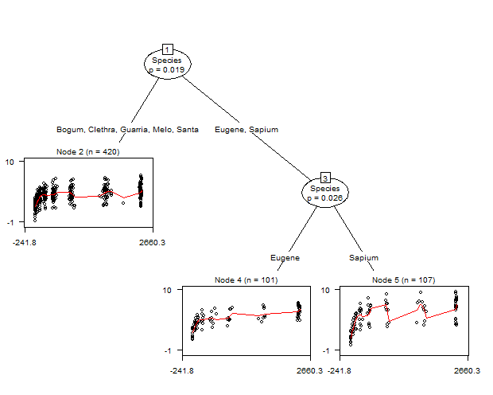
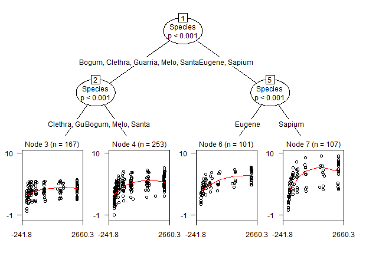
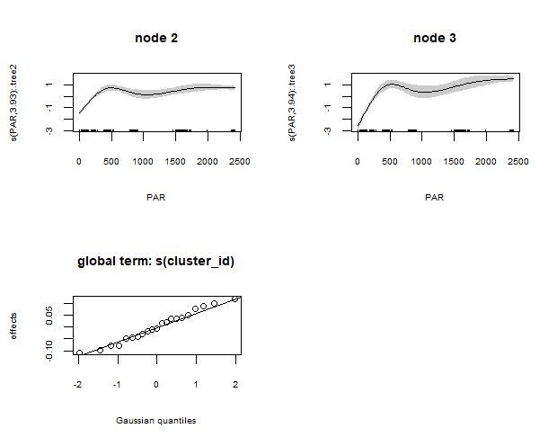
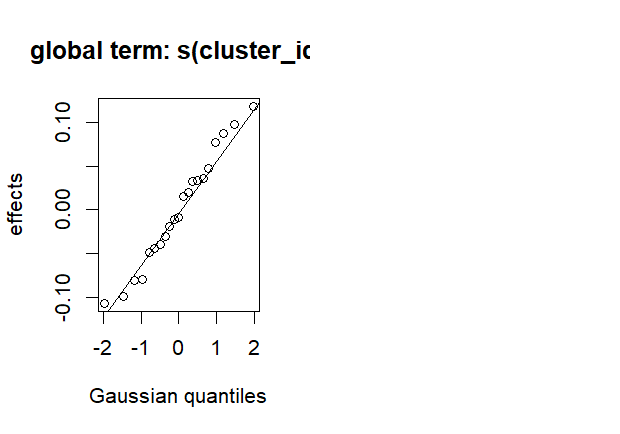

gamtree: Generalized additive model trees
=========================================

Experimental functions for fitting partially additive GAMs: GAMs comprising both global and local model components. The local components are fitted on subgroups of the training dataset, which are detected using model-based recursive partitioning. The global components are fitted on all observations of the training dataset. Specification of local components is required, specification of global components is optional. Some examples are provided below.

For fitting the smooth and parametric terms, package **mgcv** is employed. For recursive partitioning, package **partykit** is employed.

The package is experimental and much work needs to be done still.

To-do list
----------

-   Programming: Add support for fitting GAMs using `bam()` instead of `gam()` (e.g., create `bam_fit` function, or include additional argument `type = c("gam", "bam")` in `gam_fit()` function.)

-   Programming: Allow for specifying multiple different smooth function types, instead of only one, through the `FUN` argument.

-   Issue: The estimated smooths from the tree and the full GAM have similar, but not the same coefficients. Is that problematic? See section `Different coefficient estimates` below.

-   Testing of the method: Perform a simulation study to evaluate accuracy. Generate data where there is a local smooth term, with varying coefficients, as well as a global model with random effects and an additional global smooth or global parametric term. Compare accuracy of a full partially additive GAM (i.e., function `gamtree()` with `gam_form` specified), a partitioned GAM (i.e., local GAMs only; function `gamtree()` with `gam_form = NULL`), and a globally fitted GAM (i.e., no partitioning, function `gam()`).

-   Testing of the method: Compare performance of function `gamtree()` (with and without `gam_form` specified) and `gam()` as in simulation study, but use existing data.

Example
=======

First, we load the package:

``` r
library("gamtree")
```

Next, we load an example dataset to illustrate the functionality of package **gamtree**:

``` r
data(eco)
summary(eco)
#>     Species         PAR               Pn           cluster_id 
#>  Bogum  : 96   Min.   :   0.0   Min.   :-0.950   8      : 41  
#>  Clethra: 75   1st Qu.: 108.7   1st Qu.: 2.990   4      : 37  
#>  Eugene :101   Median : 458.8   Median : 4.050   11     : 37  
#>  Guarria: 92   Mean   : 975.0   Mean   : 4.131   14     : 37  
#>  Melo   : 47   3rd Qu.:2376.4   3rd Qu.: 5.082   6      : 35  
#>  Santa  :110   Max.   :2418.5   Max.   : 9.500   10     : 35  
#>  Sapium :107                                     (Other):406  
#>      noise             specimen    
#>  Min.   :-3.00805   Min.   : 2.00  
#>  1st Qu.:-0.77022   1st Qu.:14.00  
#>  Median :-0.05190   Median :25.00  
#>  Mean   :-0.03934   Mean   :25.81  
#>  3rd Qu.: 0.68309   3rd Qu.:38.00  
#>  Max.   : 3.81028   Max.   :48.00  
#> 
```

The data contain 628 observations. The `Species` variable is an indicator for plant species. Variable `PAR` well be used as a predictor for the node-specific model, variable `Pn` as the response. Variables `cluster_id` and `noise` are in fact noise variables, which will be used to specify global model terms. Finally, `specimen` is an indicator for the individual plants.

GAM-based recursive partition without global effects
----------------------------------------------------

### Specifying and fitting the model

We first fit a GAM-based recursive partition without global effects. In that case, we only have to specify the first formula argument (`tree_form`). Only the predictor and response variables need to be specified. By default, a smooth function of the predictor will be fitted, using function `s()` from package **mgcv**. The default arguments of function `s()` will be employed, later examples will show how the arguments of function `s()` can be specified:

``` r
gt1 <- gamtree(Pn ~ PAR | Species, data = eco, verbose = FALSE, 
               cluster = eco$specimen)
```

Note that we also specified the `cluster` argument, which will be passed to the recursive partitioning procedure (function `mob()` from package **partykit**) to indicate that the individual observations in the dataset are not independent, but nested within the different specimen.

Furthermore, we specified the `verbose` argument, to suppress the progress information which is printed to the command line, by default.

### Inspecting the results

We can inspect the partition by plotting it:

``` r
plot(gt1, which = "tree", gp = gpar(cex = .7))
```


By specifying the `gp` argument, the font size for the node and path labels were reduced in size.

The plots indicate similar trajectories in all three terminal nodes, revealing a sharp increase first, which then levels off. The increase appears to level off completely in node 2, while the increase in nodes 4 and 5 merely slows down.

Using the `plot` method, we can also inspect the fitted GAMs in the terminal nodes, which reveals a similar pattern:

``` r
plot(gt1, which = "nodes", residuals = TRUE)
```


The `residuals` argument is passed to the `plot.gam` method, which yields partial residuals as dots in the plotted smooths.

We can check the adequacy of the default value for `k` (i.e., 9) with the `gam.check()` function from package **mgcv**:

``` r
gam.check(gt1$gamm)
```


    #> 
    #> Method: REML   Optimizer: outer newton
    #> full convergence after 7 iterations.
    #> Gradient range [-0.0002622049,2.622044e-05]
    #> (score 1020.801 & scale 1.352414).
    #> Hessian positive definite, eigenvalue range [0.2896933,311.0641].
    #> Model rank =  30 / 30 
    #> 
    #> Basis dimension (k) checking results. Low p-value (k-index<1) may
    #> indicate that k is too low, especially if edf is close to k'.
    #> 
    #>                 k'  edf k-index p-value  
    #> s(PAR):.tree2 9.00 7.14    0.93   0.035 *
    #> s(PAR):.tree4 9.00 3.83    0.93   0.030 *
    #> s(PAR):.tree5 9.00 6.82    0.93   0.020 *
    #> ---
    #> Signif. codes:  0 '***' 0.001 '**' 0.01 '*' 0.05 '.' 0.1 ' ' 1

Although the plots seem to indicate that the smooths provide a reasonable approximation of the data, the check above indicates the default number of knots may be too low. We can increase the number of knots, to see if that increases the reported `edf` substantially. To increase the number of knots, we have to specify argument `k` of function `s()`, which can be passed through the `s_ctrl` argument:

``` r
gt2 <- gamtree(Pn ~ PAR | Species, data = eco, verbose = FALSE, 
               cluster = eco$specimen, s_ctrl = list(k = 18))
plot(gt2, which = "tree")
```


We now obtained only a single split. Increased flexibility of the smooth curves seems to have accounted for the difference between Eugene and Sapiumwe saw in the earlier tree. The response variable values appear somewhat lower at the start in node 2, compared to node 3. This difference seems to have increased at the last measurements.

We again apply the `gam.check()` function:

``` r
gam.check(gt2$gamm)
```



    #> 
    #> Method: REML   Optimizer: outer newton
    #> full convergence after 5 iterations.
    #> Gradient range [-2.435651e-05,8.19347e-07]
    #> (score 1025.089 & scale 1.403984).
    #> Hessian positive definite, eigenvalue range [1.609781,312.0615].
    #> Model rank =  36 / 36 
    #> 
    #> Basis dimension (k) checking results. Low p-value (k-index<1) may
    #> indicate that k is too low, especially if edf is close to k'.
    #> 
    #>                  k'   edf k-index p-value   
    #> s(PAR):.tree2 17.00  7.73    0.92   0.025 * 
    #> s(PAR):.tree3 17.00  6.58    0.92   0.005 **
    #> ---
    #> Signif. codes:  0 '***' 0.001 '**' 0.01 '*' 0.05 '.' 0.1 ' ' 1

The `edf` values have not increased substantially and the `k-index` values are similar to the earlier values. Thus, increasing the number of knots to a larger number than the default seems unnecessary, so we stick to the first tree.

We obtain a summary of the fitted full GAM using the `summary` method:

``` r
summary(gt1)
#> 
#> Family: gaussian 
#> Link function: identity 
#> 
#> Formula:
#> Pn ~ .tree + s(PAR, by = .tree) - 1
#> 
#> Parametric coefficients:
#>        Estimate Std. Error t value Pr(>|t|)    
#> .tree2  3.70100    0.05682   65.14   <2e-16 ***
#> .tree4  4.70995    0.11773   40.01   <2e-16 ***
#> .tree5  5.22636    0.11388   45.89   <2e-16 ***
#> ---
#> Signif. codes:  0 '***' 0.001 '**' 0.01 '*' 0.05 '.' 0.1 ' ' 1
#> 
#> Approximate significance of smooth terms:
#>                 edf Ref.df     F p-value    
#> s(PAR):.tree2 7.137  8.104 28.28  <2e-16 ***
#> s(PAR):.tree4 3.828  4.437 23.67  <2e-16 ***
#> s(PAR):.tree5 6.819  7.618 34.43  <2e-16 ***
#> ---
#> Signif. codes:  0 '***' 0.001 '**' 0.01 '*' 0.05 '.' 0.1 ' ' 1
#> 
#> R-sq.(adj) =  0.556   Deviance explained =   57%
#> -REML = 1020.8  Scale est. = 1.3524    n = 628
```

The `Parameteric coefficients` indicate that the intercepts in every terminal node are significantly different from 0. In light of the standard errors, the differences in intercepts also seem significant. Thus, the starting values appear highest in node 5, and lowest in node 2.

The `Approximate significance of smooth terms` indicate significance of the smooth terms in all three terminal nodes.

Using the `coef` method we can plot the coefficients from the terminal nodes:

``` r
coef(gt1)
#>   (Intercept)  s(PAR).1   s(PAR).2  s(PAR).3  s(PAR).4  s(PAR).5  s(PAR).6
#> 2    3.700996 -3.791637  -9.593438 -6.969658 -3.673383  1.472141  7.820281
#> 4    4.709952 -2.104618  -5.199274 -2.939236 -1.621595 -1.508664  2.026984
#> 5    5.226361 -7.311205 -11.207314 -8.153039  4.189029  5.741740 12.021556
#>     s(PAR).7 s(PAR).8  s(PAR).9
#> 2  1.3124171 7.450638 10.636708
#> 4  0.6811918 4.553318  4.359975
#> 5 -0.8861805 4.957643 21.116448
```

### Further diagnostics: gradient contributions

We can do an additional check on the observation-level contributions to the gradient. These should sum to (a value close to) zero. We can do this using the `check_grad()` function. It computes the sum of the observation-wise contributions to the gradient. These sums should be reasonably close to zero:

``` r
check_grad(gt1)
#>     (Intercept)    s(PAR).1     s(PAR).2   s(PAR).3    s(PAR).4   s(PAR).5
#> 1 -8.616961e-13 -0.02107355  0.046188828 -0.1783223  0.10776579  0.2926803
#> 2  2.822222e-12 -0.01295957  0.026294801 -0.1696880  0.07947128 -0.3685826
#> 3  4.331856e-13  0.05964000 -0.017432013  0.3101431 -0.14676311  0.1563804
#> 4  2.525601e-13  0.11722048  0.009788716 -0.4167443  0.23936972  0.3333443
#> 5 -6.767286e-13 -0.07852725 -0.112793412 -0.3527316  0.10702438 -0.2369987
#>     s(PAR).6    s(PAR).7    s(PAR).8      s(PAR).9
#> 1  0.6762989  0.30471116 -0.10116703  4.365779e-14
#> 2  0.6784864  0.04445087 -0.07748762 -1.618723e-13
#> 3 -0.5240070  0.20933853 -0.10194005  1.092282e-12
#> 4  0.1232901 -1.01936335 -0.13513208 -4.562323e-15
#> 5  0.5434242  0.08883220  0.01883222 -4.410344e-13
```

We see a substantial deviation from zero for `s(PAR)7` in (terminal) node 4. This is not yet observed in node 3, so it may be better to collapse nodes 3 and 4. This yields a larger number of observations within the same terminal node, also. However, the differences in mean and variance between the Eugene and Sapium species may be of substantial interest, which could also indicate that nodes 4 and 5 should not be collapsed. For the sake of example, we collapse nodes 4 and 5 below.

### Specifying non-default arguments for the partitioning: Restricting maximum tree depth

One way to collapse the bottom two nodes is by restricting the maximum tree. We can do that through specifying the `maxdepth` argument, which should be passed to the `mob_ctrl` argument, which controls the recursive partitioning procedure:

``` r
gt3 <- gamtree(Pn ~ PAR | Species, data = eco, verbose = FALSE,
               cluster = eco$specimen, s_ctrl = list(k=5),
               mob_ctrl = mob_control(maxdepth = 2L))
```

Function `mob_ctrl` (from package **partykit**) generates a `list` of control arguments for function `mob()`, which is used by `gamtree()` for the partitioning.

We inspect the result:

``` r
plot(gt3, which = "tree", gp = gpar(cex = .7))
```



``` r
plot(gt3, which = "nodes")
```


Indeed, by collapsing nodes 4 and 5, we get a more non-linear curve, which seems to provide a somewhat better representation of the datapoints.

GAM-based recursive partition with global effects
-------------------------------------------------

We now use function `gamertree()` to fit the same tree as above (specified through the `tree_form` argument), but now while also estimating and accounting for a global model. The global model is specified through the second `gam_form` argument, which is `NULL` by default, indicating that there are only local parameters to be estimated. Here, we supply the `noise` and `cluster_id` variables to the global model. These are noise variables, so these should not have significant or substantial effects. They merely serve to illustrate specification of the global model. We specify `noise` as having a parametric (i.e., linear) effect. We specify `cluster_id` as an indicator for a random intercept term (which can be done through function `s()` and specifying `bs = "re"`).

Again, we have to use the `s_ctrl` argument to pass the `k` argument to function `s()` used in the partitioning. Note also that the arguments for the global model are specified in the formula directly, as is customary for the `gam()` function. Note also that for the global model, both smooth and parametric terms may be specified. For the local model, only smooth terms can (currently) be employed.

``` r
gt4 <- gamtree(tree_form = Pn ~ PAR | Species, 
               gam_form = Pn ~ noise + s(cluster_id, bs = "re"),
               data = eco, verbose = FALSE, s_ctrl = list(k = 5L),  
               mob_ctrl = mob_control(maxdepth = 3L), cluster = eco$specimen)
gt4$iterations
#> [1] 2
```

Estimation converged in two iterations. Probably because accounting for the global effects has little effect for these data, as the predictors for the global model are in fact noise variables.

### Assessing the significance of smooth and parametric terms

We can obtain test statistics for the significance of the global and local effects in the full GAM using the `summary` method:

``` r
summary(gt4) 
#> 
#> Family: gaussian 
#> Link function: identity 
#> 
#> Formula:
#> Pn ~ .tree + s(PAR, k = 5, by = .tree) + noise + s(cluster_id, 
#>     bs = "re") - 1
#> 
#> Parametric coefficients:
#>         Estimate Std. Error t value Pr(>|t|)    
#> .tree2  3.703917   0.064539  57.391   <2e-16 ***
#> .tree4  4.706337   0.125471  37.509   <2e-16 ***
#> .tree5  5.203145   0.120562  43.157   <2e-16 ***
#> noise  -0.003279   0.046201  -0.071    0.943    
#> ---
#> Signif. codes:  0 '***' 0.001 '**' 0.01 '*' 0.05 '.' 0.1 ' ' 1
#> 
#> Approximate significance of smooth terms:
#>                 edf Ref.df      F p-value    
#> s(PAR):.tree2 3.868  3.987 44.872  <2e-16 ***
#> s(PAR):.tree4 3.104  3.535 25.483  <2e-16 ***
#> s(PAR):.tree5 3.846  3.982 53.152  <2e-16 ***
#> s(cluster_id) 4.039 20.000  0.254   0.201    
#> ---
#> Signif. codes:  0 '***' 0.001 '**' 0.01 '*' 0.05 '.' 0.1 ' ' 1
#> 
#> R-sq.(adj) =  0.517   Deviance explained = 53.1%
#> -REML = 1036.7  Scale est. = 1.4711    n = 628
```

Note that the standard errors and degrees of freedom for the smooth and parametric terms in the terminal nodes (i.e., those terms containing `.tree`) do not account for the searching of the tree structure and are therefore likely too low (overly optimistic), yielding too low *p* values.

The effect of the smooths is significant in every terminal tree node. As expected, the global fixed and random effects are not significant. We will probably also see this in their estimated random-effects coefficients being close to zero:

``` r
coef(gt4, which = 'global')
#>            noise  s(cluster_id).1  s(cluster_id).2  s(cluster_id).3 
#>     -0.003278629     -0.016018375      0.021554872     -0.005823459 
#>  s(cluster_id).4  s(cluster_id).5  s(cluster_id).6  s(cluster_id).7 
#>     -0.037632877     -0.071342320      0.025347130      0.021646130 
#>  s(cluster_id).8  s(cluster_id).9 s(cluster_id).10 s(cluster_id).11 
#>     -0.083477045      0.065526535     -0.031547373      0.033627088 
#> s(cluster_id).12 s(cluster_id).13 s(cluster_id).14 s(cluster_id).15 
#>      0.026420746      0.014224768     -0.074945318      0.084829151 
#> s(cluster_id).16 s(cluster_id).17 s(cluster_id).18 s(cluster_id).19 
#>     -0.034177210      0.094284254      0.050139000     -0.059608275 
#> s(cluster_id).20 s(cluster_id).21 
#>      0.001995594     -0.025023015
```

By default, the `coef` method returns the local estimates:

``` r
coef(gt4)
#>   (Intercept)  s(PAR).1   s(PAR).2  s(PAR).3 s(PAR).4
#> 2    3.703917 -1.931528  -7.317267  5.858086 3.052829
#> 4    4.706337 -1.498927  -2.958605  2.829858 2.725435
#> 5    5.203145 -4.159471 -12.730339 10.560749 6.384956
```

We can plot the tree and the models fitted in each of the terminal nodes:

``` r
plot(gt4, which = "tree", gp = gpar(cex = .7))
```



``` r
plot(gt4, which = "nodes")
```



Again, we check whether the sums of the observation-wise gradient contributions are reasonably close to zero:

``` r
check_grad(gt4)
#>     (Intercept)   s(PAR).1   s(PAR).2    s(PAR).3      s(PAR).4
#> 1  5.218430e-13 -0.2253029 -0.3258674 -0.06190288 -1.203100e-13
#> 2  1.646017e-12 -0.2354388 -0.3935031 -0.07338736  1.508342e-13
#> 3  4.598422e-13  0.2106753  0.2440816 -0.03162084  4.506898e-14
#> 4 -9.146850e-14  0.5060173 -0.3887625 -0.01021600 -6.566275e-14
#> 5  1.171814e-13 -0.2018817 -0.1952493 -0.02534253  2.535298e-15
```

All observation-wise gradient contributions sum to values reasonably close to 0.

Specifying multiple predictor variables for the node-specific GAMs
------------------------------------------------------------------

Multiple predictor variables can be specified for the node-specific model. Note that for the node-specific model, currently only smooth function can be specified; parametric terms are not supported (yet). Specifying a large number of smooth functions for the node-specific models is probably not a good idea; it will yield results which are difficult to interpret (because of the large number of coefficients) and possibly unstable, or one or more errors. The higher the complexity (i.e., the higher the df for the smooth term, the higher the number of predictor variables) of the node-specific model, the more likely that one or more spurious subgroups will be detected.

### Single smooth term with multiple predictor variables

If multiple predictors are specified in the node-specific model, they will both be passed into the same `s()` call, by default:

``` r
gt5 <- gamtree(tree_form = Pn ~ PAR + noise | Species, 
               gam_form = Pn ~ s(cluster_id, bs = "re"),
               data = eco, verbose = FALSE, s_ctrl = list(k = 5L),  
               mob_ctrl = mob_control(maxdepth = 3L))
summary(gt5$gamm)
#> 
#> Family: gaussian 
#> Link function: identity 
#> 
#> Formula:
#> Pn ~ .tree + s(PAR, noise, k = 5, by = .tree) + s(cluster_id, 
#>     bs = "re") - 1
#> 
#> Parametric coefficients:
#>        Estimate Std. Error t value Pr(>|t|)    
#> .tree3  3.21968    0.09945   32.37   <2e-16 ***
#> .tree4  3.93384    0.10681   36.83   <2e-16 ***
#> .tree6  4.16029    0.11950   34.81   <2e-16 ***
#> .tree7  4.95300    0.09044   54.77   <2e-16 ***
#> ---
#> Signif. codes:  0 '***' 0.001 '**' 0.01 '*' 0.05 '.' 0.1 ' ' 1
#> 
#> Approximate significance of smooth terms:
#>                       edf Ref.df      F  p-value    
#> s(PAR,noise):.tree3 3.561  3.870  5.348 0.000241 ***
#> s(PAR,noise):.tree4 3.891  3.991 22.862  < 2e-16 ***
#> s(PAR,noise):.tree6 3.819  3.977 19.110 4.93e-15 ***
#> s(PAR,noise):.tree7 3.952  3.998 71.810  < 2e-16 ***
#> s(cluster_id)       6.424 20.000  0.478 0.079841 .  
#> ---
#> Signif. codes:  0 '***' 0.001 '**' 0.01 '*' 0.05 '.' 0.1 ' ' 1
#> 
#> R-sq.(adj) =  0.531   Deviance explained =   55%
#> -REML = 1029.3  Scale est. = 1.4277    n = 628
coef(gt5$tree)
#>   (Intercept) s(PAR,noise).1 s(PAR,noise).2 s(PAR,noise).3 s(PAR,noise).4
#> 3    3.234613      -1.912710       5.808017      0.5976989    -0.09902575
#> 4    3.841010       1.710974       8.797858      1.4180591     0.05382627
#> 6    4.165665      10.058699       8.538073      0.8893021     0.01125373
#> 7    5.041897      48.885719      35.938586      2.5567082    -0.01713797
```

### Multiple separate smooth terms

Alternatively, multiple separate local smooth terms will be estimated if `n_FUN` argument is specified (which equals `1L`, by default):

``` r
gt6 <- gamtree(tree_form = Pn ~ PAR + noise | Species, 
               gam_form = Pn ~ s(cluster_id, bs = "re"),
               data = eco, verbose = FALSE, s_ctrl = list(k = 5L),  
               mob_ctrl = mob_control(maxdepth = 3L),
               n_FUN = 2L)
summary(gt6$gamm)
#> 
#> Family: gaussian 
#> Link function: identity 
#> 
#> Formula:
#> Pn ~ .tree + s(PAR, k = 5, by = .tree) + s(noise, k = 5, by = .tree) + 
#>     s(cluster_id, bs = "re") - 1
#> 
#> Parametric coefficients:
#>        Estimate Std. Error t value Pr(>|t|)    
#> .tree3  3.21838    0.09470   33.99   <2e-16 ***
#> .tree4  4.03440    0.07852   51.38   <2e-16 ***
#> .tree6  4.70396    0.12056   39.02   <2e-16 ***
#> .tree7  5.20909    0.11621   44.82   <2e-16 ***
#> ---
#> Signif. codes:  0 '***' 0.001 '**' 0.01 '*' 0.05 '.' 0.1 ' ' 1
#> 
#> Approximate significance of smooth terms:
#>                   edf Ref.df      F  p-value    
#> s(PAR):.tree3   3.124  3.546  5.734 0.000232 ***
#> s(PAR):.tree4   3.851  3.983 50.362  < 2e-16 ***
#> s(PAR):.tree6   3.246  3.656 27.214  < 2e-16 ***
#> s(PAR):.tree7   3.862  3.986 58.490  < 2e-16 ***
#> s(noise):.tree3 1.001  1.001  1.396 0.237981    
#> s(noise):.tree4 1.632  2.015  0.418 0.686390    
#> s(noise):.tree6 1.000  1.001  0.074 0.786475    
#> s(noise):.tree7 1.001  1.001  0.265 0.606752    
#> s(cluster_id)   5.374 20.000  0.375 0.118184    
#> ---
#> Signif. codes:  0 '***' 0.001 '**' 0.01 '*' 0.05 '.' 0.1 ' ' 1
#> 
#> R-sq.(adj) =  0.564   Deviance explained = 58.2%
#> -REML = 1013.1  Scale est. = 1.3293    n = 628
coef(gt6)
#>   (Intercept)      s(PAR).1      s(PAR).2      s(PAR).3   s(PAR).4
#> 3    3.218384 -8.166839e-01 -2.488543e+00  2.344719e+00  1.2967829
#> 4    4.034395 -1.685025e+00 -3.587925e+00  3.219624e+00  2.9580629
#> 6    4.703957 -3.357547e-06  1.130255e-05  1.639038e-04 -0.1058827
#> 7    5.209090 -1.281079e-05  5.052262e-06 -3.637538e-05  0.0316039
#>      s(noise).1    s(noise).2    s(noise).3  s(noise).4
#> 3 -2.293770e+00 -8.272536e+00  6.6960687214  3.68462374
#> 4 -4.151161e+00 -1.308307e+01 10.7695298267  6.40490175
#> 6  6.117589e-02  3.571054e-02  0.2036688912  0.07144024
#> 7  4.323274e-05 -4.141037e-05 -0.0003098126 -0.05972293
```

In `gt6`, the same value of `k` was used for both predictors, as only one value was specified. If multiple smooth terms are specified, and different arguments should be employed for fitting their smooth functions, a `list` composed of `n_FUN` lists should be supplied to the `s_ctrl` argument. For example, if we want to specify different values of `k` for the smooth terms of the `PAR` and `noise` variables, we specify a `list` containing separate lists of control arguments for the smooth functions. These sublists should have the order in which the predictors for the node-specific models are supplied in the `tree_form`. E.g.:

``` r
gt7 <- gamtree(tree_form = Pn ~ PAR + noise | Species, 
               gam_form = Pn ~ s(cluster_id, bs = "re"),
               data = eco, verbose = FALSE, 
               s_ctrl = list(list(k = 5L), list(k = 4L)),  
               mob_ctrl = mob_control(maxdepth = 3L),
               n_FUN = 2L)
summary(gt7$gamm)
#> 
#> Family: gaussian 
#> Link function: identity 
#> 
#> Formula:
#> Pn ~ .tree + s(PAR, k = 5, by = .tree) + s(noise, k = 4, by = .tree) + 
#>     s(cluster_id, bs = "re") - 1
#> 
#> Parametric coefficients:
#>        Estimate Std. Error t value Pr(>|t|)    
#> .tree3  3.21839    0.09470   33.98   <2e-16 ***
#> .tree4  4.03464    0.07851   51.39   <2e-16 ***
#> .tree6  4.70396    0.12057   39.02   <2e-16 ***
#> .tree7  5.20910    0.11622   44.82   <2e-16 ***
#> ---
#> Signif. codes:  0 '***' 0.001 '**' 0.01 '*' 0.05 '.' 0.1 ' ' 1
#> 
#> Approximate significance of smooth terms:
#>                   edf Ref.df      F  p-value    
#> s(PAR):.tree3   3.124  3.546  5.733 0.000232 ***
#> s(PAR):.tree4   3.851  3.983 50.367  < 2e-16 ***
#> s(PAR):.tree6   3.246  3.656 27.214  < 2e-16 ***
#> s(PAR):.tree7   3.862  3.986 58.489  < 2e-16 ***
#> s(noise):.tree3 1.001  1.001  1.396 0.237976    
#> s(noise):.tree4 1.596  1.944  0.384 0.663328    
#> s(noise):.tree6 1.001  1.001  0.074 0.786673    
#> s(noise):.tree7 1.001  1.002  0.264 0.607137    
#> s(cluster_id)   5.376 20.000  0.375 0.118145    
#> ---
#> Signif. codes:  0 '***' 0.001 '**' 0.01 '*' 0.05 '.' 0.1 ' ' 1
#> 
#> R-sq.(adj) =  0.563   Deviance explained = 58.2%
#> -REML = 1013.1  Scale est. = 1.3293    n = 628
coef(gt7)
#>   (Intercept)    s(PAR).1      s(PAR).2      s(PAR).3     s(PAR).4
#> 3    3.218393 -0.81663949 -2.488026e+00  2.344355e+00 1.2967003073
#> 4    4.034637  3.68483996 -1.685012e+00 -3.587683e+00 3.2194348322
#> 6    4.703963 10.76956565  6.404830e+00 -4.793093e-06 0.0001495877
#> 7    5.209097  0.07734186 -1.530996e-05 -1.160859e-04 0.0315928081
#>      s(noise).1    s(noise).2   s(noise).3
#> 3 -2.293427e+00 -8.2784542582   6.70025178
#> 4  2.958042e+00 -4.1510617904 -13.08310081
#> 6 -1.058721e-01  0.0739608607   0.13584806
#> 7  6.819311e-05 -0.0004910158  -0.05972269
```

We see that for `PAR`, ($k - 1 = $) 4 coefficients were estimated, and for \`noise\`, ($k -1 =$) 3 coefficients were estimated.

### Using smooth functions other than `s()`

Alternatively, a different function than `s()` can be employed by specifying the `FUN` argument (which equals `"s"`, by default). The `k` argument has a different effect for `te()` than for `s()`, so we set it to a lower value here:

``` r
gt8 <- gamtree(tree_form = Pn ~ PAR + noise | Species, 
               gam_form = Pn ~ s(cluster_id, bs = "re"),
               data = eco, verbose = FALSE, s_ctrl = list(k = 3L),  
               mob_ctrl = mob_control(maxdepth = 3L),
               FUN = "te")
summary(gt8$gamm)
#> 
#> Family: gaussian 
#> Link function: identity 
#> 
#> Formula:
#> Pn ~ .tree + te(PAR, noise, k = 3, by = .tree) + s(cluster_id, 
#>     bs = "re") - 1
#> 
#> Parametric coefficients:
#>        Estimate Std. Error t value Pr(>|t|)    
#> .tree3  3.22699    0.10039   32.15   <2e-16 ***
#> .tree4  4.03382    0.08266   48.80   <2e-16 ***
#> .tree6  4.71681    0.12807   36.83   <2e-16 ***
#> .tree7  5.25377    0.12631   41.59   <2e-16 ***
#> ---
#> Signif. codes:  0 '***' 0.001 '**' 0.01 '*' 0.05 '.' 0.1 ' ' 1
#> 
#> Approximate significance of smooth terms:
#>                        edf Ref.df      F  p-value    
#> te(PAR,noise):.tree3 3.975  4.364  4.461  0.00115 ** 
#> te(PAR,noise):.tree4 4.687  4.925 29.703  < 2e-16 ***
#> te(PAR,noise):.tree6 4.345  4.872 17.256 1.15e-15 ***
#> te(PAR,noise):.tree7 6.337  7.093 25.371  < 2e-16 ***
#> s(cluster_id)        4.707 20.000  0.311  0.15707    
#> ---
#> Signif. codes:  0 '***' 0.001 '**' 0.01 '*' 0.05 '.' 0.1 ' ' 1
#> 
#> R-sq.(adj) =  0.506   Deviance explained = 52.7%
#> -REML = 1023.4  Scale est. = 1.5059    n = 628
coef(gt8$tree)
#>   (Intercept) te(PAR,noise).1 te(PAR,noise).2 te(PAR,noise).3
#> 3    3.236996      -0.5061737      -1.0361279       0.5822966
#> 4    3.978833      -0.6561934      -0.6385351       0.2817264
#> 6    4.873337      -0.6330718      -1.2422168       0.6965196
#> 7    5.200054      -0.7250602      -1.6299230       1.0690797
#>   te(PAR,noise).4 te(PAR,noise).5 te(PAR,noise).6 te(PAR,noise).7
#> 3       0.2082286      -0.1316632       0.3586793       0.3537505
#> 4       1.4394798       0.1922294       1.3481133       1.7226577
#> 6       1.0157525      -0.4229346       1.2664058       2.2286502
#> 7       2.1109914       1.0724397       3.2269832       2.9825189
#>   te(PAR,noise).8
#> 3       0.3917477
#> 4       0.7414001
#> 6       1.3803256
#> 7      -0.2205939
summary(gt8$gamm)
#> 
#> Family: gaussian 
#> Link function: identity 
#> 
#> Formula:
#> Pn ~ .tree + te(PAR, noise, k = 3, by = .tree) + s(cluster_id, 
#>     bs = "re") - 1
#> 
#> Parametric coefficients:
#>        Estimate Std. Error t value Pr(>|t|)    
#> .tree3  3.22699    0.10039   32.15   <2e-16 ***
#> .tree4  4.03382    0.08266   48.80   <2e-16 ***
#> .tree6  4.71681    0.12807   36.83   <2e-16 ***
#> .tree7  5.25377    0.12631   41.59   <2e-16 ***
#> ---
#> Signif. codes:  0 '***' 0.001 '**' 0.01 '*' 0.05 '.' 0.1 ' ' 1
#> 
#> Approximate significance of smooth terms:
#>                        edf Ref.df      F  p-value    
#> te(PAR,noise):.tree3 3.975  4.364  4.461  0.00115 ** 
#> te(PAR,noise):.tree4 4.687  4.925 29.703  < 2e-16 ***
#> te(PAR,noise):.tree6 4.345  4.872 17.256 1.15e-15 ***
#> te(PAR,noise):.tree7 6.337  7.093 25.371  < 2e-16 ***
#> s(cluster_id)        4.707 20.000  0.311  0.15707    
#> ---
#> Signif. codes:  0 '***' 0.001 '**' 0.01 '*' 0.05 '.' 0.1 ' ' 1
#> 
#> R-sq.(adj) =  0.506   Deviance explained = 52.7%
#> -REML = 1023.4  Scale est. = 1.5059    n = 628
coef(gt8$tree)
#>   (Intercept) te(PAR,noise).1 te(PAR,noise).2 te(PAR,noise).3
#> 3    3.236996      -0.5061737      -1.0361279       0.5822966
#> 4    3.978833      -0.6561934      -0.6385351       0.2817264
#> 6    4.873337      -0.6330718      -1.2422168       0.6965196
#> 7    5.200054      -0.7250602      -1.6299230       1.0690797
#>   te(PAR,noise).4 te(PAR,noise).5 te(PAR,noise).6 te(PAR,noise).7
#> 3       0.2082286      -0.1316632       0.3586793       0.3537505
#> 4       1.4394798       0.1922294       1.3481133       1.7226577
#> 6       1.0157525      -0.4229346       1.2664058       2.2286502
#> 7       2.1109914       1.0724397       3.2269832       2.9825189
#>   te(PAR,noise).8
#> 3       0.3917477
#> 4       0.7414001
#> 6       1.3803256
#> 7      -0.2205939
coef(gt8)
#>   (Intercept) te(PAR,noise).1 te(PAR,noise).2 te(PAR,noise).3
#> 3    3.226989     -0.52593006      -1.2102758       0.6054083
#> 4    4.033823     -0.12487788      -0.3783834       1.0489740
#> 6    4.716810     -0.54706470      -1.0733902       0.6256302
#> 7    5.253774      0.06016471      -2.3764919       2.3290790
#>   te(PAR,noise).4 te(PAR,noise).5 te(PAR,noise).6 te(PAR,noise).7
#> 3        0.170882      -0.3297969       0.3622443       0.3722335
#> 4        1.660066       0.1624764       1.3300500       1.7902407
#> 6        1.062898      -0.2411836       1.4814966       2.0341977
#> 7        2.798302       2.6803633       3.5081386       3.2422801
#>   te(PAR,noise).8
#> 3       0.4416770
#> 4       0.4715978
#> 6       1.4965639
#> 7      -1.2748124
gt8$gamm_form
#> Pn ~ .tree + te(PAR, noise, k = 3, by = .tree) + s(cluster_id, 
#>     bs = "re") - 1
coef(gt8$gamm)
#>                 .tree3                 .tree4                 .tree6 
#>            3.226989405            4.033823020            4.716809508 
#>                 .tree7 te(PAR,noise):.tree3.1 te(PAR,noise):.tree3.2 
#>            5.253774440           -0.525930061           -1.210275796 
#> te(PAR,noise):.tree3.3 te(PAR,noise):.tree3.4 te(PAR,noise):.tree3.5 
#>            0.605408280            0.170882018           -0.329796931 
#> te(PAR,noise):.tree3.6 te(PAR,noise):.tree3.7 te(PAR,noise):.tree3.8 
#>            0.362244320            0.372233473            0.441677011 
#> te(PAR,noise):.tree4.1 te(PAR,noise):.tree4.2 te(PAR,noise):.tree4.3 
#>           -0.124877881           -0.378383440            1.048974009 
#> te(PAR,noise):.tree4.4 te(PAR,noise):.tree4.5 te(PAR,noise):.tree4.6 
#>            1.660065628            0.162476447            1.330050041 
#> te(PAR,noise):.tree4.7 te(PAR,noise):.tree4.8 te(PAR,noise):.tree6.1 
#>            1.790240726            0.471597832           -0.547064697 
#> te(PAR,noise):.tree6.2 te(PAR,noise):.tree6.3 te(PAR,noise):.tree6.4 
#>           -1.073390152            0.625630217            1.062897630 
#> te(PAR,noise):.tree6.5 te(PAR,noise):.tree6.6 te(PAR,noise):.tree6.7 
#>           -0.241183645            1.481496634            2.034197735 
#> te(PAR,noise):.tree6.8 te(PAR,noise):.tree7.1 te(PAR,noise):.tree7.2 
#>            1.496563940            0.060164711           -2.376491920 
#> te(PAR,noise):.tree7.3 te(PAR,noise):.tree7.4 te(PAR,noise):.tree7.5 
#>            2.329079049            2.798302070            2.680363282 
#> te(PAR,noise):.tree7.6 te(PAR,noise):.tree7.7 te(PAR,noise):.tree7.8 
#>            3.508138609            3.242280112           -1.274812431 
#>        s(cluster_id).1        s(cluster_id).2        s(cluster_id).3 
#>           -0.016693232            0.059494971           -0.001292052 
#>        s(cluster_id).4        s(cluster_id).5        s(cluster_id).6 
#>           -0.010908071           -0.070064816            0.051711227 
#>        s(cluster_id).7        s(cluster_id).8        s(cluster_id).9 
#>            0.008920763           -0.102026014            0.058838710 
#>       s(cluster_id).10       s(cluster_id).11       s(cluster_id).12 
#>           -0.061727603            0.033469029            0.073043778 
#>       s(cluster_id).13       s(cluster_id).14       s(cluster_id).15 
#>            0.045203523           -0.096003808            0.074375643 
#>       s(cluster_id).16       s(cluster_id).17       s(cluster_id).18 
#>           -0.043153245            0.081587316            0.073710898 
#>       s(cluster_id).19       s(cluster_id).20       s(cluster_id).21 
#>           -0.088375219           -0.026336847           -0.043774951
gt8$tree_form
#> Pn ~ PAR + noise | Species
```

Issue: Different coefficient estimates
======================================

The estimated coefficients from the final tree use the predictions based on global effects from the full GAM from the second-to-last iteration. As far as I know, this should yield the exact same coefficient estimates between the tree and the full GAM. But they are not (though similar) and I am not sure if this is something to be worried about:

### Differences in estimated coefficients

``` r
coef(gt4)
#>   (Intercept)  s(PAR).1   s(PAR).2  s(PAR).3 s(PAR).4
#> 2    3.703917 -1.931528  -7.317267  5.858086 3.052829
#> 4    4.706337 -1.498927  -2.958605  2.829858 2.725435
#> 5    5.203145 -4.159471 -12.730339 10.560749 6.384956
coef(gt4$tree)
#>   (Intercept)  s(PAR).1   s(PAR).2 s(PAR).3 s(PAR).4
#> 2    3.682770 -2.065017  -7.261800 5.807493 3.025790
#> 4    4.872520  1.384173  -4.892841 4.275722 3.319776
#> 5    5.200471 -4.065100 -11.799440 9.882020 6.370985
```

``` r
plot(gt4, which = "nodes")
```


``` r
par(mfrow = c(2, 3))
plot(gt4$gamm)
```


The plots also indicate very similar, but not identical effects.

### Differences in predicted values

We can also compare the predicted values:

``` r
newdat <- eco
newdat$x <- newdat$PAR
preds <- data.frame(gam = predict(gt4$gamm),
                    tree = predict(gt4$tree, newdata = newdat, 
                                   type = "response"))
cor(preds)
#>            gam      tree
#> gam  1.0000000 0.9988546
#> tree 0.9988546 1.0000000
colMeans(preds)
#>      gam     tree 
#> 4.130796 4.132704
sapply(preds, var)
#>      gam     tree 
#> 1.560570 1.558577
sapply(preds, max)
#>      gam     tree 
#> 6.934200 6.872156
sapply(preds, min)
#>      gam     tree 
#> 2.036504 2.158467
cols <- c(rep("white", times = 2), "yellow", "orange", "white", 
          "purple", "blue") 
plot(preds, col = cols[predict(gt4$tree)])
```


The predicted values seem very similar, but not the same.

### Differences in absence of global model

The same happens when we have no global smooth or parametric functions, but re-estimate the smooth parameters, given the subgroups from the tree:

``` r
coef(gt1)
#>   (Intercept)  s(PAR).1   s(PAR).2  s(PAR).3  s(PAR).4  s(PAR).5  s(PAR).6
#> 2    3.700996 -3.791637  -9.593438 -6.969658 -3.673383  1.472141  7.820281
#> 4    4.709952 -2.104618  -5.199274 -2.939236 -1.621595 -1.508664  2.026984
#> 5    5.226361 -7.311205 -11.207314 -8.153039  4.189029  5.741740 12.021556
#>     s(PAR).7 s(PAR).8  s(PAR).9
#> 2  1.3124171 7.450638 10.636708
#> 4  0.6811918 4.553318  4.359975
#> 5 -0.8861805 4.957643 21.116448
coef(gt1$tree)
#>   (Intercept)  s(PAR).1   s(PAR).2  s(PAR).3  s(PAR).4  s(PAR).5  s(PAR).6
#> 2    3.680405 -4.097417  -9.747088 -7.261808 -3.423061 -1.268304  8.574276
#> 4    4.875050  2.118485  -9.365924 -7.057664 -1.791072 -2.357813  4.049454
#> 5    5.196168 -5.583318 -14.790424 -9.290344 -3.934561 -7.341857 -4.233135
#>     s(PAR).7  s(PAR).8 s(PAR).9
#> 2 -0.1558398  7.445995 10.84713
#> 4 -2.9141972  8.524812  7.73419
#> 5 -3.0578102 12.046898 12.24184
```

``` r
plot(gt1, which = "nodes")
```


``` r
par(mfrow = c(2, 2))
plot(gt1$gamm)
```


``` r
preds <- data.frame(gam = predict(gt1$gamm),
                    tree = predict(gt1$tree, newdata = gt1$data, 
                                   type = "response"))
cor(preds)
#>            gam      tree
#> gam  1.0000000 0.9968733
#> tree 0.9968733 1.0000000
colMeans(preds)
#>      gam     tree 
#> 4.130796 4.130796
sapply(preds, var)
#>      gam     tree 
#> 1.671901 1.655734
sapply(preds, max)
#>      gam     tree 
#> 6.969520 6.888124
sapply(preds, min)
#>      gam     tree 
#> 1.345396 1.688563
cols <- c(rep("white", times = 3), "yellow", "orange", "red", "white", 
          "purple", "blue") 
plot(preds, col = cols[predict(gt1$tree)])
```


Differences are likely related to the scale and smoothing parameters not being the same:

``` r
gt1$gamm$sp
#> s(PAR):.tree2 s(PAR):.tree4 s(PAR):.tree5 
#>   0.009399824   0.087834973   0.001969105
gt1$gamm$scale
#> [1] 1.352414
gt1$tree[[2]]$node$info$object$sp
#>      s(PAR) 
#> 0.009713257
gt1$tree[[2]]$node$info$object$scale
#> [1] 1.236955
gt1$tree[[4]]$node$info$object$sp
#>     s(PAR) 
#> 0.01699203
gt1$tree[[4]]$node$info$object$scale
#> [1] 0.9533168
gt1$tree[[5]]$node$info$object$sp
#>      s(PAR) 
#> 0.009963582
gt1$tree[[5]]$node$info$object$scale
#> [1] 2.275768
```
