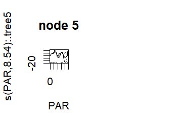
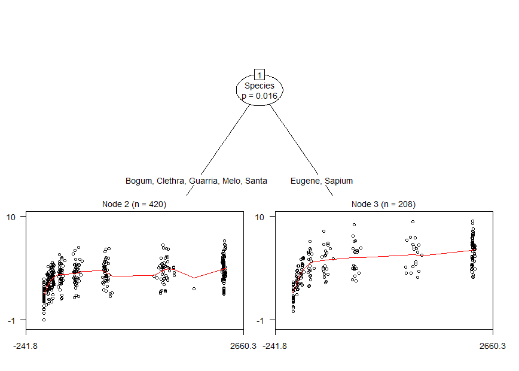
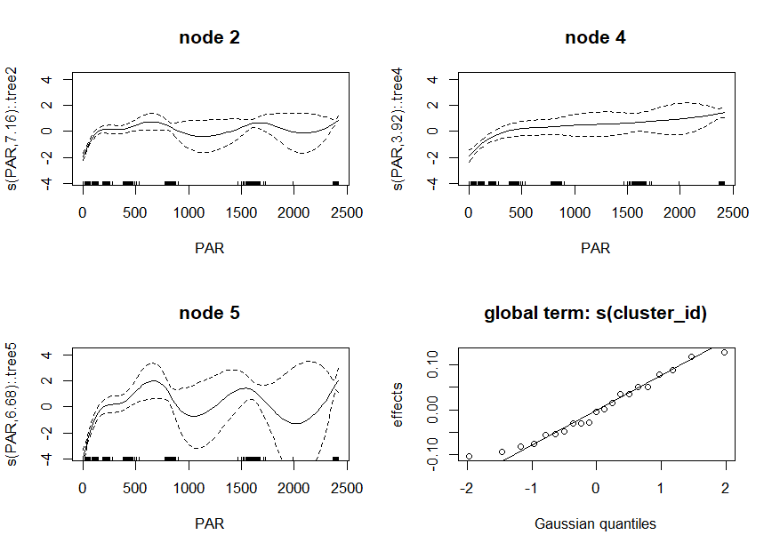

gamtree: Generalized additive model trees
=========================================

Experimental functions for fitting partially additive GAMs: GAMs comprising both global and local model components. The local components are fitted on subgroups of the training dataset, which are detected using model-based recursive partitioning. The global components are fitted on all observations of the training dataset. Specification of local components is required, specification of global components is optional. Some examples are provided below.

For fitting the smooth and parametric terms, package **mgcv** is employed. For recursive partitioning, package **partykit** is employed.

The package is experimental, much work needs to be done.

Example
=======

First, we load the package:

``` r
library("gamtree")
```

Next, we load an example dataset to illustrate the functionality of package **gamtree**:

``` r
data(eco)
summary(eco)
#>     Species         PAR               Pn           cluster_id 
#>  Bogum  : 96   Min.   :   0.0   Min.   :-0.950   8      : 41  
#>  Clethra: 75   1st Qu.: 108.7   1st Qu.: 2.990   4      : 37  
#>  Eugene :101   Median : 458.8   Median : 4.050   11     : 37  
#>  Guarria: 92   Mean   : 975.0   Mean   : 4.131   14     : 37  
#>  Melo   : 47   3rd Qu.:2376.4   3rd Qu.: 5.082   6      : 35  
#>  Santa  :110   Max.   :2418.5   Max.   : 9.500   10     : 35  
#>  Sapium :107                                     (Other):406  
#>      noise             specimen    
#>  Min.   :-3.00805   Min.   : 2.00  
#>  1st Qu.:-0.77022   1st Qu.:14.00  
#>  Median :-0.05190   Median :25.00  
#>  Mean   :-0.03934   Mean   :25.81  
#>  3rd Qu.: 0.68309   3rd Qu.:38.00  
#>  Max.   : 3.81028   Max.   :48.00  
#> 
```

The data contain 628 observations. The `Species` variable is an indicator for plant species. Variable `PAR` well be used as a predictor for the node-specific model, variable `Pn` as the response. Variables `cluster_id` and `noise` are in fact noise variables, which will be used to specify global model terms. Finally, `specimen` is an indicator for the individual plants.

GAM-based recursive partition without global effects
----------------------------------------------------

We first fit a GAM-based recursive partition without global effects. In that case, we only have to specify the first formula argument (`tree_form`). Only the predictor and response variables need to be specified. By default, a smooth function of the predictor will be fitted, using function `s()` from package **mgcv**. The default arguments of function `s()` will be employed, later examples will show how the arguments of function `s()` can be specified:

``` r
gt1 <- gamtree(Pn ~ PAR | Species, data = eco, verbose = FALSE, 
               cluster = eco$specimen)
```

Note that we also specified the `cluster` argument, which will be passed to the recursive partitioning procedure (function `mob()` from package **partykit**) to indicate that the individual observations in the dataset are not independent, but nested within the different specimen.

Furthermore, we specified the `verbose` argument, to suppress the progress information which is printed to the command line, by default.

We can inspect the partition by plotting the tree:

``` r
plot(gt1, which = "tree", treeplot_ctrl = list(gp = gpar(cex = .7)))
```


Through the `treeplot_ctrl` argument, we can specify additional argument to be passed to function `plot.party()`. We passed the `gp` argument, to have a smaller font size for the node and path labels than the default `cex = 1`.

The plots indicate similar trajectories in all three terminal nodes, revealing a sharp increase first, which then levels off. The increase appears to level off completely in node 2, while the increase in nodes 4 and 5 only slows down towards the right end.

Alternatively, we can also plot the fitted GAMs in each of the terminal nodes, which reveals a similar pattern:

``` r
plot(gt1, which = "nodes", gamplot_ctrl = list(residuals = TRUE))
```


We used the `gamplot_ctrl` argument to pass additional arguments to function `plot.gam()`. We specified the `residuals` argument, so that partial residuals are included as dots in the plotted smooths.

Evaluating the adequacy of the basis used to represent the smooth terms
-----------------------------------------------------------------------

The plots indicate that the lines of the fitted smooths are somewhat wiggly, especially in node 2. Perhaps the default dimension for the basis used to represent the smooth term, `k = 9`, may not be adequate for these data. In addition to the above visual inspection of how well the smooths appear to approximate the datapoints, we can use the `gam.check()` function from package **mgcv** to check the adequacy of the dimension of the basis used to represent the smooth term:

``` r
gam.check(gt1$gamm)
#> 
#> Method: REML   Optimizer: outer newton
#> full convergence after 7 iterations.
#> Gradient range [-0.0002622049,2.622044e-05]
#> (score 1020.801 & scale 1.352414).
#> Hessian positive definite, eigenvalue range [0.2896933,311.0641].
#> Model rank =  30 / 30 
#> 
#> Basis dimension (k) checking results. Low p-value (k-index<1) may
#> indicate that k is too low, especially if edf is close to k'.
#> 
#>                 k'  edf k-index p-value  
#> s(PAR):.tree2 9.00 7.14    0.93    0.03 *
#> s(PAR):.tree4 9.00 3.83    0.93    0.05 *
#> s(PAR):.tree5 9.00 6.82    0.93    0.02 *
#> ---
#> Signif. codes:  0 '***' 0.001 '**' 0.01 '*' 0.05 '.' 0.1 ' ' 1
```

By default, `gam.check()` also yields residual plots, which are omitted here. The values of `k-index` and `p-value` above indicate that the default `k = 9` may be too low. This is in contrast with the somewhat too wiggly pattern of the smooths we observed in the plots of the smooth terms and datapoints, which suggests the value of `k` may be too high.

Based on the `gam.check()` function results, we could increase the value of `k`, to see if that increases the reported `edf` substantially. We supply a larger value for `k` through the `s_ctrl` argument:

``` r
gt2 <- gamtree(Pn ~ PAR | Species, data = eco, verbose = FALSE, 
               cluster = eco$specimen, s_ctrl = list(k = 18))
plot(gt2, which = "tree", treeplot_ctrl = list(gp = gpar(cex = .7)))
```


We now obtained only a single split. Increased flexibility of the smooth curves seems to have accounted for the difference between Eugene and Sapium we saw in the earlier tree. Otherwise, the results seem the smaew as before: The response variable values appear somewhat lower at the start in node 2, compared to node 3. This difference seems to have increased at the last measurements.

We again apply the `gam.check()` function:

``` r
gam.check(gt2$gamm)
#> 
#> Method: REML   Optimizer: outer newton
#> full convergence after 5 iterations.
#> Gradient range [-2.435651e-05,8.19347e-07]
#> (score 1025.089 & scale 1.403984).
#> Hessian positive definite, eigenvalue range [1.609781,312.0615].
#> Model rank =  36 / 36 
#> 
#> Basis dimension (k) checking results. Low p-value (k-index<1) may
#> indicate that k is too low, especially if edf is close to k'.
#> 
#>                  k'   edf k-index p-value   
#> s(PAR):.tree2 17.00  7.73    0.92   0.015 * 
#> s(PAR):.tree3 17.00  6.58    0.92   0.010 **
#> ---
#> Signif. codes:  0 '***' 0.001 '**' 0.01 '*' 0.05 '.' 0.1 ' ' 1
```

The `edf` values have not increased substantially and the `k-index` values are similar to the earlier values. Thus, increasing the number of knots to a larger number than the default seems not necessary.

We can also reduce the value of `k` to see if that yields less wiggly lines, and perhaps a different tree:

``` r
gt3 <- gamtree(tree_form = Pn ~ PAR | Species, data = eco, 
               cluster = eco$specimen, verbose = FALSE, s_ctrl = list(k = 5))
plot(gt3, which = "tree", treeplot_ctrl = list(gp = gpar(cex = .7)))
```


``` r
plot(gt3, which = "nodes", gamplot_ctrl = list(residuals = TRUE))
```



To the eye, a lower value dimension for the bases to represent the smooth terms seems to be more appriate, as it yields less wiggly lines. The lower value for `k` does not seem to yield a different tree or conclusions anyway. For now, we will stick with the value of `k = 5`.

Further inspection of the fitted model
--------------------------------------

We obtain a summary of the fitted full GAM using the `summary` method:

``` r
summary(gt3)
#> 
#> Family: gaussian 
#> Link function: identity 
#> 
#> Formula:
#> Pn ~ .tree + s(PAR, k = 5, by = .tree) - 1
#> 
#> Parametric coefficients:
#>        Estimate Std. Error t value Pr(>|t|)    
#> .tree2  3.70162    0.05946   62.25   <2e-16 ***
#> .tree4  4.70998    0.12307   38.27   <2e-16 ***
#> .tree5  5.19878    0.11775   44.15   <2e-16 ***
#> ---
#> Signif. codes:  0 '***' 0.001 '**' 0.01 '*' 0.05 '.' 0.1 ' ' 1
#> 
#> Approximate significance of smooth terms:
#>                 edf Ref.df     F p-value    
#> s(PAR):.tree2 3.869  3.988 44.65  <2e-16 ***
#> s(PAR):.tree4 3.061  3.498 25.61  <2e-16 ***
#> s(PAR):.tree5 3.848  3.984 53.32  <2e-16 ***
#> ---
#> Signif. codes:  0 '***' 0.001 '**' 0.01 '*' 0.05 '.' 0.1 ' ' 1
#> 
#> R-sq.(adj) =  0.514   Deviance explained = 52.4%
#> -REML = 1034.8  Scale est. = 1.4813    n = 628
```

Note that the standard errors and degrees of freedom for the smooth and parametric terms in the terminal nodes (i.e., those terms containing `.tree`) do not account for the searching of the tree structure and are therefore likely too low (overly optimistic), yielding too low *p* values.

The `Parameteric coefficients` indicate that the intercepts in every terminal node are significantly different from 0. In light of the standard errors, the differences in intercepts also seem significant. Thus, the starting values appear highest in node 5, and lowest in node 2.

The `Approximate significance of smooth terms` indicate significance of the smooth terms in all three terminal nodes.

Using the `coef` method we can print the coefficients from the terminal nodes:

``` r
coef(gt3)
#>   (Intercept)  s(PAR).1   s(PAR).2  s(PAR).3 s(PAR).4
#> 2    3.701622 -1.919938  -7.354504  5.872871 3.046255
#> 4    4.709980 -1.432097  -2.737333  2.712305 2.638366
#> 5    5.198775 -4.155897 -12.830898 10.650817 6.385477
```

We can do an additional check on the observation-level contributions to the gradient. These should sum to (a value close to) zero. We can do this using the `check_grad()` function. It computes the sum of the observation-wise contributions to the gradient. These sums should be reasonably close to zero:

``` r
check_grad(gt3)
#>     (Intercept)   s(PAR).1   s(PAR).2     s(PAR).3      s(PAR).4
#> 1 -1.328514e-12 -0.2229052 -0.3263868 -0.062062577  2.233179e-13
#> 2  5.329686e-13 -0.2310867 -0.3937828 -0.073902025  5.143761e-13
#> 3  1.378203e-13  0.2108973  0.2446822 -0.031231124  3.154733e-13
#> 4 -2.010545e-13  0.5391678 -0.3921504 -0.001776875 -1.833637e-13
#> 5  1.756460e-13 -0.1995831 -0.1948963 -0.025229130  5.905346e-14
```

The sum of the gradient contributions seem reasonably close to zero.

Specifying non-default arguments for the partitioning: Restricting maximum tree depth
-------------------------------------------------------------------------------------

Let's say would prefer to collapse nodes 4 and 5, because we do not think the differences between the two species are relevant. We can do that through specifying the `maxdepth` argument of function `mob()`, which is used internally by function `gamtree()` to perform the partitioning (splitting). We can pass additional arguments to function `mob()` with the `mob_ctrl` argument:

``` r
gt4 <- gamtree(Pn ~ PAR | Species, data = eco, verbose = FALSE,
               cluster = eco$specimen, s_ctrl = list(k=5),
               mob_ctrl = mob_control(maxdepth = 2L))
```

Note that function `mob_control()` (from package **partykit**) is used here, to generate a `list` of control arguments for function `mob()`.

We inspect the result:

``` r
plot(gt4, which = "tree", treeplot_ctrl = list(gp = gpar(cex = .7)))
```



GAM-based recursive partition with global effects
-------------------------------------------------

We now also include a global part in the fitted model. That is, we specify the partitiong and the node-specific models exactly as above, but we introduce global terms, that will be evaluated globally, using all observations.

The global model is specified through the second `gam_form` argument, which is `NULL` by default, resulting in only the partitiong and local parameters to be estimated. We will now also include global terms based on the `noise` and `cluster_id` variables. As both are in fact noise variables, so these should not have significant or substantial effects. They merely serve as an illustration of specifying a global model. We will specify `noise` as having a parametric (i.e., linear) effect and `cluster_id` as an indicator for a random intercept term (which can be fitted using function `s()` and specifying `bs = "re"`).

Again, we have to use the `s_ctrl` argument to pass the `k` argument to the (local) `s()` functions used in the partitioning. Note also that we can specify the arguments for the global model directly in the `gam_form`, in the way that is customary for formulas passed to function `gam()`. Note that, unlike for the local models, for the global model, both smooth and parametric terms may be specified.

To estimate both the local (`tree_form`) and global (`gam_form`) models, an iterative approach is taken:

-   Step 0: Initialize by assuming the global effects to be zero.

-   Step 1: Given the current estimate of the global effects, estimate the partition (subgroup structure).

-   Step 2: Given the current estimate of the partition (subgroup structure), estimate the local and global effects.

-   Step 3: Repeat steps 1 and 2 untill convergence (i.e., change in log-likelihood values from one iteration to the next is smaller than `abstol`).

``` r
gt5 <- gamtree(tree_form = Pn ~ PAR | Species, 
               gam_form = Pn ~ noise + s(cluster_id, bs = "re"),
               data = eco, verbose = FALSE, s_ctrl = list(k = 5L),  
               cluster = eco$specimen)
gt5$iterations
#> [1] 2
```

Estimation converged in two iterations. Probably because accounting for the global effects has little effect for these data, as the predictors for the global model are in fact noise variables, the global effects are thus 0 and the initial estimate of the global effects is already adequate.

We can obtain test statistics for the significance of the global and local effects in the full GAM using the `summary` method:

``` r
summary(gt5) 
#> 
#> Family: gaussian 
#> Link function: identity 
#> 
#> Formula:
#> Pn ~ .tree + s(PAR, k = 5, by = .tree) + noise + s(cluster_id, 
#>     bs = "re") - 1
#> 
#> Parametric coefficients:
#>         Estimate Std. Error t value Pr(>|t|)    
#> .tree2  3.703917   0.064539  57.391   <2e-16 ***
#> .tree4  4.706337   0.125471  37.509   <2e-16 ***
#> .tree5  5.203145   0.120562  43.157   <2e-16 ***
#> noise  -0.003279   0.046201  -0.071    0.943    
#> ---
#> Signif. codes:  0 '***' 0.001 '**' 0.01 '*' 0.05 '.' 0.1 ' ' 1
#> 
#> Approximate significance of smooth terms:
#>                 edf Ref.df      F p-value    
#> s(PAR):.tree2 3.868  3.987 44.872  <2e-16 ***
#> s(PAR):.tree4 3.104  3.535 25.483  <2e-16 ***
#> s(PAR):.tree5 3.846  3.982 53.152  <2e-16 ***
#> s(cluster_id) 4.039 20.000  0.254   0.201    
#> ---
#> Signif. codes:  0 '***' 0.001 '**' 0.01 '*' 0.05 '.' 0.1 ' ' 1
#> 
#> R-sq.(adj) =  0.517   Deviance explained = 53.1%
#> -REML = 1036.7  Scale est. = 1.4711    n = 628
```

Note that the standard errors and degrees of freedom for the smooth and parametric terms in the terminal nodes (i.e., those terms containing `.tree`) do not account for the searching of the tree structure and are therefore likely too low (overly optimistic), yielding too low *p* values.

The effect of the local smooths are significant in every terminal tree node. As expected, the global fixed and random effects (`noise` and `s(cluster_id)`) are not significant. We will probably also see this in their estimated random-effects coefficients being close to zero:

``` r
coef(gt5, which = 'global')
#>            noise  s(cluster_id).1  s(cluster_id).2  s(cluster_id).3 
#>     -0.003278629     -0.016018375      0.021554872     -0.005823459 
#>  s(cluster_id).4  s(cluster_id).5  s(cluster_id).6  s(cluster_id).7 
#>     -0.037632877     -0.071342320      0.025347130      0.021646130 
#>  s(cluster_id).8  s(cluster_id).9 s(cluster_id).10 s(cluster_id).11 
#>     -0.083477045      0.065526535     -0.031547373      0.033627088 
#> s(cluster_id).12 s(cluster_id).13 s(cluster_id).14 s(cluster_id).15 
#>      0.026420746      0.014224768     -0.074945318      0.084829151 
#> s(cluster_id).16 s(cluster_id).17 s(cluster_id).18 s(cluster_id).19 
#>     -0.034177210      0.094284254      0.050139000     -0.059608275 
#> s(cluster_id).20 s(cluster_id).21 
#>      0.001995594     -0.025023015
```

Note that by default, the `coef` method returns the local estimates, but we can obtain the global coefficient estimates by specifying the `which` argument.

We can plot the tree and the models fitted in each of the terminal nodes:

``` r
plot(gt5, which = "tree", treeplot_ctrl = list(gp = gpar(cex = .7)))
```


``` r
plot(gt5, which = "nodes")
```


The local models are very similar those in the earlier tree, as the global terms have minor/zero effects.

We can again check whether the sums of the observation-wise gradient contributions are reasonably close to zero:

``` r
check_grad(gt5)
#>     (Intercept)   s(PAR).1   s(PAR).2     s(PAR).3      s(PAR).4
#> 1 -1.328514e-12 -0.2229052 -0.3263868 -0.062062577  2.233179e-13
#> 2  5.329686e-13 -0.2310867 -0.3937828 -0.073902025  5.143761e-13
#> 3  1.378203e-13  0.2108973  0.2446822 -0.031231124  3.154733e-13
#> 4 -2.010545e-13  0.5391678 -0.3921504 -0.001776875 -1.833637e-13
#> 5  1.756460e-13 -0.1995831 -0.1948963 -0.025229130  5.905346e-14
```

All observation-wise gradient contributions sum to values reasonably close to 0.

Specifying multiple predictor variables for the node-specific GAMs
------------------------------------------------------------------

Multiple predictor variables can be specified for the node-specific model. Note that for the node-specific model, currently only smooth function can be specified; parametric terms are not supported (yet). Specifying a large number of smooth functions for the node-specific models is probably not a good idea; it will yield results which are difficult to interpret (because of the large number of coefficients) and possibly unstable, or one or more errors. The higher the complexity (i.e., the higher the df for the smooth term, the higher the number of predictor variables) of the node-specific model, the more likely that one or more spurious subgroups will be detected.

If multiple predictors are specified in the node-specific model, they will both be passed into the same `s()` call, by default. Although there is no good substantive reason to include `PAR` and `noise` in the same smooth term here, we do it anyway for illustration purposes. Note also, what when specifying multiple predictor variables for the same smooth term, the basis for representing the smooth term may need to be of higher dimension, so it would probably be inappropriate to specify `k = 5` in most real-world situations.

``` r
gt6 <- gamtree(tree_form = Pn ~ PAR + noise | Species, 
               gam_form = Pn ~ s(cluster_id, bs = "re"),
               data = eco, verbose = FALSE, cluster = eco$specimen,
               s_ctrl = list(k = 5L))
summary(gt6)
#> 
#> Family: gaussian 
#> Link function: identity 
#> 
#> Formula:
#> Pn ~ .tree + s(PAR, noise, k = 5, by = .tree) + s(cluster_id, 
#>     bs = "re") - 1
#> 
#> Parametric coefficients:
#>        Estimate Std. Error t value Pr(>|t|)    
#> .tree2  3.54108    0.07591   46.65   <2e-16 ***
#> .tree4  4.15776    0.12016   34.60   <2e-16 ***
#> .tree6  4.70105    0.12669   37.11   <2e-16 ***
#> .tree7  5.21290    0.12227   42.63   <2e-16 ***
#> ---
#> Signif. codes:  0 '***' 0.001 '**' 0.01 '*' 0.05 '.' 0.1 ' ' 1
#> 
#> Approximate significance of smooth terms:
#>                       edf Ref.df      F  p-value    
#> s(PAR,noise):.tree2 3.909  3.993 23.429  < 2e-16 ***
#> s(PAR,noise):.tree4 3.814  3.975 18.586 1.26e-14 ***
#> s(PAR,noise):.tree6 3.721  3.944 22.939  < 2e-16 ***
#> s(PAR,noise):.tree7 3.948  3.998 52.387  < 2e-16 ***
#> s(cluster_id)       5.642 20.000  0.396    0.114    
#> ---
#> Signif. codes:  0 '***' 0.001 '**' 0.01 '*' 0.05 '.' 0.1 ' ' 1
#> 
#> R-sq.(adj) =  0.519   Deviance explained = 53.7%
#> -REML = 1036.8  Scale est. = 1.4654    n = 628
```

Alternatively, multiple separate local smooth terms will be estimated if `n_FUN` argument is specified (which equals `1L`, by default):

``` r
gt7 <- gamtree(tree_form = Pn ~ PAR + noise | Species, 
               gam_form = Pn ~ s(cluster_id, bs = "re"),
               data = eco, verbose = FALSE, s_ctrl = list(k = 5L),  
               cluster = eco$specimen, n_FUN = 2L)
summary(gt7)
#> 
#> Family: gaussian 
#> Link function: identity 
#> 
#> Formula:
#> Pn ~ s(PAR, k = 5) + s(noise, k = 5) + s(cluster_id, bs = "re")
#> 
#> Parametric coefficients:
#>             Estimate Std. Error t value Pr(>|t|)    
#> (Intercept)  4.13196    0.06257   66.04   <2e-16 ***
#> ---
#> Signif. codes:  0 '***' 0.001 '**' 0.01 '*' 0.05 '.' 0.1 ' ' 1
#> 
#> Approximate significance of smooth terms:
#>                 edf Ref.df      F p-value    
#> s(PAR)        3.911  3.994 86.410  <2e-16 ***
#> s(noise)      1.550  1.922  0.448   0.570    
#> s(cluster_id) 3.923 20.000  0.244   0.213    
#> ---
#> Signif. codes:  0 '***' 0.001 '**' 0.01 '*' 0.05 '.' 0.1 ' ' 1
#> 
#> R-sq.(adj) =  0.359   Deviance explained = 36.9%
#> -REML = 1114.8  Scale est. = 1.9519    n = 628
```

In this case, no subgroups were created. Adding a smooth for a noise variable may have reduced the power to detect group differences.

Note that in `gt7`, the same value of `k` was used for both smooths and predictor variables, as only one value was specified. If multiple smooth terms are specified for the node-specific model, and different argument values should be employed for fitting their smooths, a `list` composed of `n_FUN` lists should be supplied to the `s_ctrl` argument.

For example, if we want to specify different values of `k` for the smooth terms of the `PAR` and `noise` variables, we specify a `list` containing separate lists of control arguments for the smooth functions. These sublists should have the order in which the predictors for the node-specific models are supplied in the `tree_form`. Here, we also specify a higher value for *α* (the pre-specified significance level for making a split), so that :

``` r
gt8 <- gamtree(tree_form = Pn ~ PAR + noise | Species, 
               gam_form = Pn ~ s(cluster_id, bs = "re"),
               data = eco, verbose = FALSE, 
               s_ctrl = list(list(k = 5L), list(k = 3L)),  
               mob_ctrl = mob_control(alpha = .25),
               cluster = eco$specimen, n_FUN = 2L)
summary(gt8)
#> 
#> Family: gaussian 
#> Link function: identity 
#> 
#> Formula:
#> Pn ~ .tree + s(PAR, k = 5, by = .tree) + s(noise, k = 3, by = .tree) + 
#>     s(cluster_id, bs = "re") - 1
#> 
#> Parametric coefficients:
#>        Estimate Std. Error t value Pr(>|t|)    
#> .tree2  3.70502    0.06505   56.95   <2e-16 ***
#> .tree4  4.70549    0.12570   37.43   <2e-16 ***
#> .tree5  5.20765    0.12106   43.02   <2e-16 ***
#> ---
#> Signif. codes:  0 '***' 0.001 '**' 0.01 '*' 0.05 '.' 0.1 ' ' 1
#> 
#> Approximate significance of smooth terms:
#>                   edf Ref.df      F p-value    
#> s(PAR):.tree2   3.870  3.987 45.147  <2e-16 ***
#> s(PAR):.tree4   3.139  3.568 25.137  <2e-16 ***
#> s(PAR):.tree5   3.847  3.983 54.901  <2e-16 ***
#> s(noise):.tree2 1.740  1.931  1.394   0.250    
#> s(noise):.tree4 1.001  1.001  0.056   0.814    
#> s(noise):.tree5 1.001  1.002  0.224   0.636    
#> s(cluster_id)   4.449 20.000  0.288   0.177    
#> ---
#> Signif. codes:  0 '***' 0.001 '**' 0.01 '*' 0.05 '.' 0.1 ' ' 1
#> 
#> R-sq.(adj) =  0.518   Deviance explained = 53.5%
#> -REML = 1037.9  Scale est. = 1.4664    n = 628
```

We see that for `PAR`, a higher `edf` value was obtained than for `noise`, which is what would be expected for a true predictor versus a noise variable.

### Using smooth functions other than `s()`

Alternatively, a different function than `s()` can be employed by specifying the `FUN` argument (which equals `"s"`, by default). The `k` argument has a different effect for `te()` than for `s()`, so we set it to a lower value here:

``` r
gt9 <- gamtree(tree_form = Pn ~ PAR + noise | Species, 
               gam_form = Pn ~ s(cluster_id, bs = "re"),
               data = eco, verbose = FALSE, s_ctrl = list(k = 3L),  
               mob_ctrl = mob_control(maxdepth = 3L),
               FUN = "te")
summary(gt9)
#> 
#> Family: gaussian 
#> Link function: identity 
#> 
#> Formula:
#> Pn ~ .tree + te(PAR, noise, k = 3, by = .tree) + s(cluster_id, 
#>     bs = "re") - 1
#> 
#> Parametric coefficients:
#>        Estimate Std. Error t value Pr(>|t|)    
#> .tree3  3.22699    0.10039   32.15   <2e-16 ***
#> .tree4  4.03382    0.08266   48.80   <2e-16 ***
#> .tree6  4.71681    0.12807   36.83   <2e-16 ***
#> .tree7  5.25377    0.12631   41.59   <2e-16 ***
#> ---
#> Signif. codes:  0 '***' 0.001 '**' 0.01 '*' 0.05 '.' 0.1 ' ' 1
#> 
#> Approximate significance of smooth terms:
#>                        edf Ref.df      F  p-value    
#> te(PAR,noise):.tree3 3.975  4.364  4.461  0.00115 ** 
#> te(PAR,noise):.tree4 4.687  4.925 29.703  < 2e-16 ***
#> te(PAR,noise):.tree6 4.345  4.872 17.256 1.15e-15 ***
#> te(PAR,noise):.tree7 6.337  7.093 25.371  < 2e-16 ***
#> s(cluster_id)        4.707 20.000  0.311  0.15707    
#> ---
#> Signif. codes:  0 '***' 0.001 '**' 0.01 '*' 0.05 '.' 0.1 ' ' 1
#> 
#> R-sq.(adj) =  0.506   Deviance explained = 52.7%
#> -REML = 1023.4  Scale est. = 1.5059    n = 628
```

To-do list
==========

-   Programming: Add support for fitting GAMs using `bam()` instead of `gam()` (e.g., create `bam_fit` function, or include additional argument `type = c("gam", "bam")` in `gam_fit()` function.)

-   Programming: Allow for specifying multiple different smooth function types, instead of only one, through the `FUN` argument.

-   Issue: The estimated smooths from the tree and the full GAM have similar, but not the same coefficients. Is that problematic? See section below.

-   Testing of the method: Perform a simulation study to evaluate accuracy. Generate data where there is a local smooth term, with varying coefficients, as well as a global model with random effects and an additional global smooth or global parametric term. Compare accuracy of a full partially additive GAM (i.e., function `gamtree()` with `gam_form` specified), a partitioned GAM (i.e., local GAMs only; function `gamtree()` with `gam_form = NULL`), and a globally fitted GAM (i.e., no partitioning, function `gam()`).

-   Testing of the method: Compare performance of function `gamtree()` (with and without `gam_form` specified) and `gam()` as in simulation study, but use existing data.

Issue: Different coefficient estimates
======================================

The estimated coefficients from the final tree use the predictions based on global effects from the full GAM from the second-to-last iteration:

``` r
coef(gt3)
#>   (Intercept)  s(PAR).1   s(PAR).2  s(PAR).3 s(PAR).4
#> 2    3.701622 -1.919938  -7.354504  5.872871 3.046255
#> 4    4.709980 -1.432097  -2.737333  2.712305 2.638366
#> 5    5.198775 -4.155897 -12.830898 10.650817 6.385477
coef(gt3$tree)
#>   (Intercept)  s(PAR).1   s(PAR).2 s(PAR).3 s(PAR).4
#> 2    3.680405 -2.053585  -7.294140 5.819719 3.018558
#> 4    4.875050  1.345614  -4.577744 4.093756 3.226012
#> 5    5.196168 -4.058283 -11.869635 9.951660 6.366812
```

The 'severity' of the differences between the estimated coefficients is difficult to judge. If we look at the plotted partial effects of the smooth terms, we see very similar, but not identical effects.

The partial effects as estimated in the tree nodes:

``` r
plot(gt3, which = "nodes", gamplot_ctrl = list(residuals = TRUE, ylim = c(-3.8, 4.2)))
```


The partial effects as estimated in the full model:

``` r
par(mfrow = c(2, 2))
plot(gt3$gamm, residuals = TRUE, ylim = c(-3.8, 4.2))
```



We can also compare the predicted values:

``` r
newdat <- eco
newdat$x <- newdat$PAR
preds <- data.frame(gam = predict(gt4$gamm),
                    tree = predict(gt4$tree, newdata = newdat, 
                                   type = "response"))
cor(preds)
#>           gam     tree
#> gam  1.000000 0.999984
#> tree 0.999984 1.000000
colMeans(preds)
#>      gam     tree 
#> 4.130796 4.130796
sapply(preds, var)
#>      gam     tree 
#> 1.515587 1.514599
sapply(preds, max)
#>      gam     tree 
#> 6.452986 6.454960
sapply(preds, min)
#>      gam     tree 
#> 2.254761 2.247853
cols <- c(rep("white", times = 2), "yellow", "orange", "white", 
          "purple", "blue") 
plot(preds, col = cols[predict(gt4$tree)])
```


The predicted values are very similar, but not the identical.

The differences may be due to the different way of estimating a smooth with the `by` argument specified (which is used for estimating the full GAM), and estimating separate smooths in each subgroup (which is done in estimating the partition with local GAMs). Differences may be due to the scale and smoothing parameters not being the same between these two approaches:

The smoothing and scale parameters for the full GAM:

``` r
gt3$gamm$sp
#> s(PAR):.tree2 s(PAR):.tree4 s(PAR):.tree5 
#>   0.011686631   0.039933930   0.003534879
gt3$gamm$scale
#> [1] 1.481275
```

For the GAMs in the terminal nodes, there are three smoothing parameters, which differ from the tree in the full GAM:

``` r
gt3$tree[[2]]$node$info$object$sp
#>     s(PAR) 
#> 0.01040063
gt3$tree[[4]]$node$info$object$sp
#>     s(PAR) 
#> 0.01605249
gt3$tree[[5]]$node$info$object$sp
#>      s(PAR) 
#> 0.006355633
```

This is probably also due to the estimation of a separate scale parameter in each node, instead of only one in the full GAM:

``` r
gt3$tree[[2]]$node$info$object$scale
#> [1] 1.340797
gt3$tree[[4]]$node$info$object$scale
#> [1] 1.042304
gt3$tree[[5]]$node$info$object$scale
#> [1] 2.448892
```
